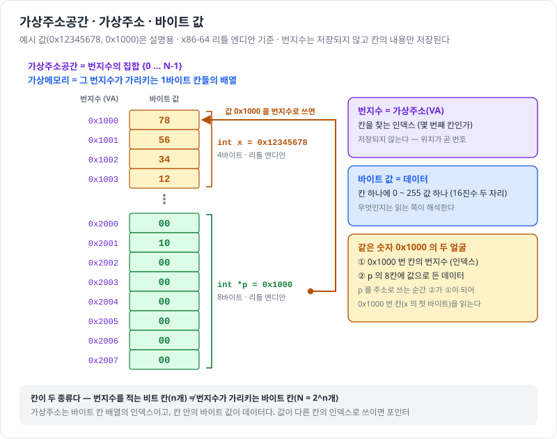
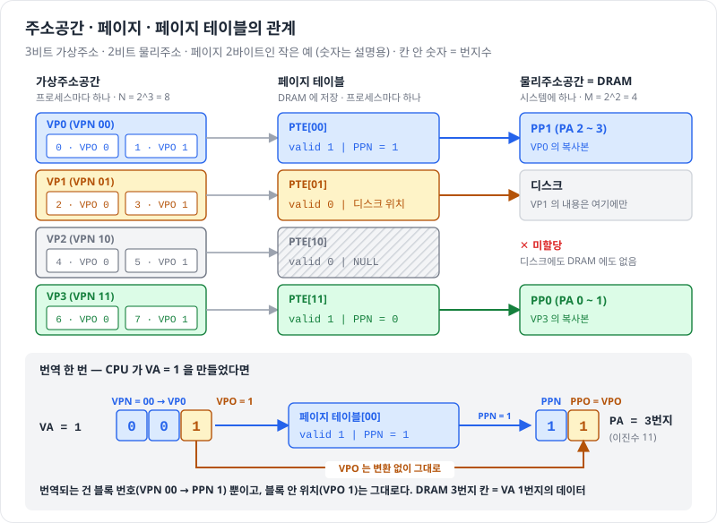
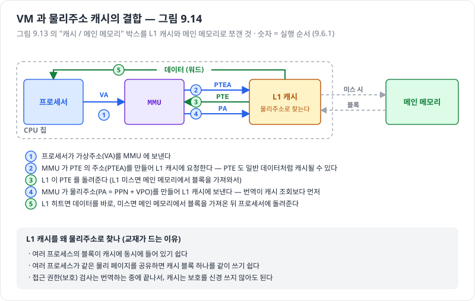
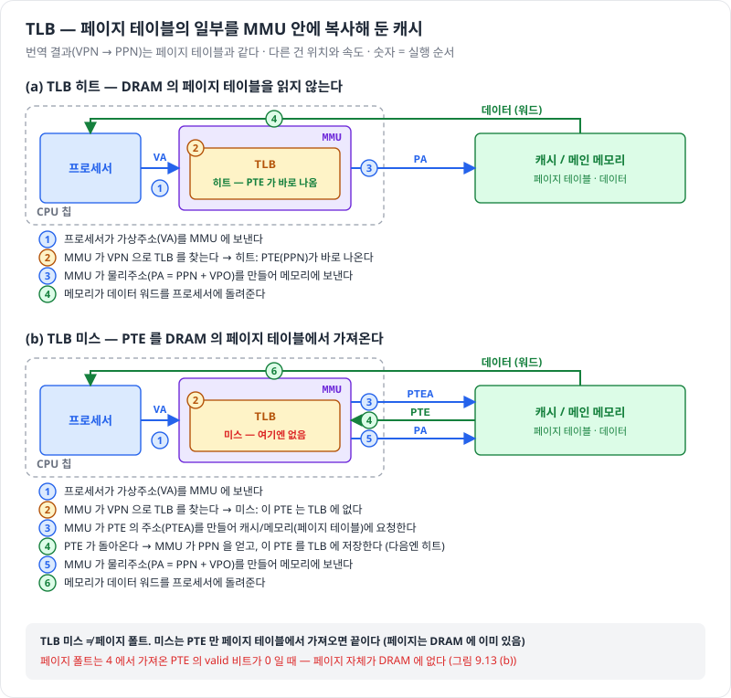

# 9.6 주소의 번역

> 진척도 이슈 : [#204](https://github.com/Jongeume/krafton-jungle-2026/issues/204)

> [!NOTE]
> **요약**  
> 주소 번역 = 가상 주소공간(VAS)과 물리 주소공간(PAS)의 원소를 잇는 매핑.  
> **VPN 만 PPN 으로 바꾸고, VPO 는 그대로 붙인다.**  
> PA = ( PPN | VPO ). PTE 에 VPO 는 없다.

> [!TIP]
> **비유**  
> 주소 = "몇 쪽의 몇 번째 줄".  
> 번역은 쪽 번호(VPN)만 실제 쪽(PPN)으로 바꾸고, 줄 번호(VPO)는 그대로 둔다.  
> 가상 쪽과 실제 쪽의 크기가 같으니 줄 번호는 바꿀 필요가 없다.

> **기호 읽는 법**  
> - VPN : 몇 번째 가상 페이지인가 (n − p 비트)  
> - VPO : 페이지 안에서 몇 번째 바이트인가 (p 비트)  
> - PPN : 몇 번째 물리 페이지인가 (m − p 비트)  
> - PPO : = VPO  
> - PTBR : 현재 프로세스의 페이지 테이블을 가리키는 레지스터

## 용어 사전

### 주소 — 번지수와 번지수의 집합

| 용어 | 뜻 | 있는 곳 | 헷갈림 |
| --- | --- | --- | --- |
| 주소(번지수) | 바이트 칸 하나의 번호(인덱스). 칸의 내용이 아님 | 저장되지 않음 (위치가 곧 번호) | 포인터 변수에 담기면 값(내용), 칸을 가리키는 데 쓰이는 순간 번지수 |
| 바이트 칸 / 바이트 값 | 번지수가 가리키는 1바이트 칸. 그 안에 든 0 ~ 255 값이 데이터 | 디스크(원본) + DRAM(복사본) | 번지수를 적는 비트 칸과 다르다. 칸 안의 값이 무엇인지는 읽는 쪽이 해석한다 |
| 가상주소공간 | 번지수의 집합 0 ~ N-1. 그 개수가 크기, N = 2^n | 저장되지 않음 (범위일 뿐) | 프로세스마다 하나. 번지수 목록은 같고 번지수가 가리키는 칸이 다르다 |
| 물리주소공간 | DRAM 칸의 번지수 집합 0 ~ M-1, M = 2^m | DRAM 하드웨어 | 시스템에 하나뿐 |
| 가상주소(VA) | 가상주소공간의 원소. CPU가 명령어로 계산해 낸 숫자. n비트 = (VPN \| VPO) | 레지스터, 포인터 변수 | 디스크에 저장되는 게 아니다. 디스크에는 칸의 내용만 있다 |
| 물리주소(PA) | 물리주소공간의 원소. MMU가 만든다. m비트 = (PPN \| PPO) | MMU가 DRAM으로 내보내는 번지수 | VA와 숫자가 달라도 같은 데이터를 가리킨다 (3비트 예시: VA 1 은 PA 3) |

### 페이지 — 주소공간을 같은 크기 블록으로 자른 것

| 용어 | 뜻 | 있는 곳 | 헷갈림 |
| --- | --- | --- | --- |
| 페이지 | 주소공간을 같은 크기로 자른 블록. 크기 P = 2^p 바이트 | 가상·물리 양쪽 공간 | P는 바이트 개수, p는 오프셋을 적는 비트 수 |
| 가상 페이지(VP) | 가상주소공간의 블록. 내용의 원본은 디스크 | 디스크(원본) + DRAM(일부 복사본) | 미할당 VP는 디스크 공간도 없다 |
| 물리 페이지(PP) | DRAM의 블록. VP의 복사본을 담는 칸 | DRAM | VP와 같은 크기 P |
| VPN | 몇 번째 VP인가(블록 번호). n-p 비트 | VA의 앞부분 | 페이지 테이블을 찾는 열쇠 |
| VPO (= PPO) | 블록 안에서 몇 번째 바이트인가(블록 안 위치). p비트 | VA의 뒷부분 | 번역하지 않고 그대로 PA 뒤에 붙인다. PTE에 들어 있지 않다 |
| PPN | 몇 번째 PP인가. m-p 비트 | PTE 안 | PA = (PPN \| VPO) |

### 번역 — VA를 PA로 바꾸는 장치와 표

| 용어 | 뜻 | 있는 곳 | 헷갈림 |
| --- | --- | --- | --- |
| MMU | VA를 PA로 바꾸는 하드웨어 | CPU 칩 안 | 번역할 때마다 페이지 테이블(TLB 히트면 TLB)을 읽는다 |
| 페이지 테이블 | VPN → PPN 대응표 | DRAM (OS가 관리) | 프로세스마다 하나. 현재 것은 PTBR 레지스터가 가리킨다. 주소공간을 정의하는 실체 |
| PTE | 페이지 테이블의 한 줄 (valid \| PPN 또는 디스크 위치) | 페이지 테이블 안 | VPO는 들어 있지 않다 |
| valid 비트 | 이 VP가 DRAM에 캐시되어 있나. 1이면 히트, 0이면 미캐시 또는 미할당 | PTE 안 | valid 0 이면서 주소가 NULL 이면 미할당, 아니면 디스크 위치 |
| 페이지 폴트 | valid 0 인 VP를 접근해 일어나는 예외. OS가 디스크에서 DRAM으로 가져온다 | OS 핸들러 | 요청한 페이지(들여올 것)와 희생 페이지(쫓아낼 것)가 따로 있다. TLB 미스와 다르다 |
| 수정 비트(dirty) | DRAM 사본이 디스크 원본과 달라졌나 | PTE 안 (일반적으로) | 수정된 희생 페이지만 쫓겨날 때 디스크에 쓴다 (write-back) |

### 캐시 — 같은 데이터를 더 빠른 곳에 복사해 둔 것

| 용어 | 뜻 | 있는 곳 | 헷갈림 |
| --- | --- | --- | --- |
| DRAM 캐시 | DRAM이 디스크의 VP를 캐싱하는 것. 완전 결합, write-back | DRAM | 큼, 느림. 미스 비용이 커서 페이지가 크다 |
| L1 캐시 | SRAM. 메인 메모리 블록을 캐싱하고 물리주소로 찾는다 | CPU 칩 안 | DRAM 캐시와 다른 층. 번역이 캐시 조회보다 먼저 |
| TLB | PTE의 캐시. VPN → PPN 번역 결과를 MMU 안에 복사해 둠 | MMU 안 | TLB 미스는 PTE만 가져오면 끝. 페이지 폴트가 아니다 |

## 주소 번역

- MAP(A) : 가상주소 A 의 매핑  
    - A 의 데이터가 PAS 의 물리주소 A' 에 있으면 → MAP(A) = A'  
    - A 의 데이터가 물리 메모리에 없으면 → MAP(A) = ∅ (공집합)  
- PTBR (페이지 테이블 베이스 레지스터)  
    - 정정 : PRBR → PTBR  
    - 현재 프로세스의 페이지 테이블을 가리킨다

### 가상주소와 물리주소의 구성

- 가상주소 = ( VPN | VPO )  
    - VPN (가상페이지 번호) : 몇 번째 페이지인가 (어느 페이지냐)  
    - VPO (가상페이지 오프셋) : 그 페이지 안에서 몇 번째 바이트인가 (페이지 안의 위치)  
    - n 비트 가상주소라면  
        - VPN : n − p 비트  
        - VPO : p 비트  
- 물리주소 = ( PPN | PPO )  
    - PP, VP 모두 P 바이트  
    - → PPO (물리페이지 오프셋) = VPO

3비트 예시

```
비트 번호     2    1 |  0
              └─VPN─┘  └VPO
            (n-1 ~ p)  (p-1 ~ 0)

가장 앞(최상위) 비트는 n-1 번
```

## 번지수와 바이트 값 — 포인터로 보기



- 가상주소공간 = n 비트로 적을 수 있는 **번지수의 집합** {0 … N-1}  
    - 바이트 칸의 모음이 아니다  
- 가상메모리(개념) = 그 번지수가 가리키는 **1바이트 칸들의 배열** (N 개)  
- 가상주소 = 그 배열의 **인덱스**(번지수)  
    - 위치가 곧 번호라서 메모리에 저장되지 않는다  
- 바이트 값 = 칸 안의 **데이터** (0 ~ 255)  
    - 무엇인지는 읽는 쪽이 해석한다 (int 의 한 조각, 명령어, 포인터의 한 조각 …)  
- 칸이 두 종류  
    - 번지수를 적는 **비트 칸** (n 개)  
    - 번지수가 가리키는 **바이트 칸** (N = 2^n 개)  
- 포인터  
    - 칸 안의 값(0x1000)이 load 의 주소로 쓰이는 순간 다른 칸의 번지수가 된다  
    - → 같은 숫자가 값이기도, 번지수이기도 하다

## 한눈에 보기 — 주소공간 · 페이지 · 페이지 테이블



- 주소공간 = 번지수의 **집합**, 그 개수가 크기  
    - 가상 : N = 2^n, 프로세스마다 하나  
    - 물리 : M = 2^m, 시스템에 하나  
- 페이지 = 두 공간을 같은 크기 P = 2^p 바이트 블록으로 자른 것  
    - VP : 내용의 원본은 디스크  
    - PP : DRAM, VP 의 복사본  
- 번지수 = [블록 번호 | 블록 안 위치]  
    - VA = [VPN | VPO]  
    - PA = [PPN | PPO], PPO = VPO  
- 페이지 테이블 = VPN → PPN 대응표 (DRAM, 프로세스마다)  
    - PTE = [valid | PPN 또는 디스크 위치]  
    - **VPO 는 PTE 에 없다** (VA 에 있다)  
- 번역 = VPN 으로 PTE 를 찾아 PPN 을 꺼내고, VPO 를 그대로 붙인다  
    - 번역되는 건 블록 번호뿐  
- 표기 : 대문자 = **개수**, 소문자 = 그 번호를 적는 **비트 수** (N = 2^n, M = 2^m, P = 2^p)

## 그림 9.13 — 페이지 히트와 페이지 폴트


- 히트 : PTE 의 valid = 1  
    - MMU 가 PA (= PPN + VPO) 를 만들어 DRAM 에 접근  
- 폴트 : valid = 0  
    1. 예외  
    2. OS 핸들러가 처리  
    3. 원래 명령 재시작  
    4. 이번엔 히트  
- 폴트 처리에는 페이지가 **두 개** 나온다  
    - 요청한 페이지 : valid = 0, 디스크에 있음, DRAM 으로 **들여올** 대상  
    - 희생 페이지 : DRAM 에 이미 있는 **다른** 페이지 (valid = 1), 자리를 비우려고 쫓아냄  
        - DRAM 에 빈 PP 가 있으면 희생 없이 바로 가져온다  
    - 희생 페이지는 **들여오기 때문에** 고른다. 수정(store) 자체로는 고르지 않는다  
        - 이미 DRAM 에 있는 페이지에 store → DRAM 사본만 바꾸고 수정 비트 1  
- 수정된 페이지(dirty) = DRAM 사본이 디스크 원본과 달라진 페이지 (DRAM 에 있는 동안 store 를 받음)  
    - 희생 페이지가 수정됨 → 디스크 원본 자리에 **덮어써서 저장**(page out) 후 버림  
    - 수정 안 됨 → 디스크 원본과 같으니 그냥 버림  
    - 쫓겨난 페이지의 PTE : valid = 0, 주소 필드 = 디스크상의 그 페이지 위치  
- DRAM 이 write-back 인 이유  
    - store 마다 디스크에 쓰면 너무 느리다 (디스크는 DRAM 의 약 10만 배)  
    - DRAM 만 바꾸고 **쫓겨날 때 한 번** 반영 (같은 페이지에 store 100번 → 디스크 쓰기 1번)  
    - 트레이드오프  
        - 얻는 것 : 디스크 쓰기 횟수 감소  
        - 내주는 것 : DRAM 사본과 디스크 원본이 달라지는 구간 → 수정 비트로 따로 기록  
    - 힙 · 스택 페이지는 처음 쓸 때 DRAM 에서 0 으로 만들어져 디스크에 원본이 없다  
        - 쫓겨날 때 처음 swap 영역에 저장

## 그림 9.14 — VM 과 L1 캐시 (9.6.1)



- 그림 9.13 의 "캐시 / 메인 메모리" 박스를 **L1 캐시 + 메인 메모리로 쪼갠 것**  
- 캐시가 두 종류  
    - DRAM 캐시 (9.3) : 디스크 페이지를 캐싱, 큼 · 느림  
    - **L1 캐시** : SRAM, 메인 메모리 블록을 캐싱, 작음 · 빠름  
- 질문 : L1 캐시를 가상주소로 찾을까, 물리주소로 찾을까 → 대부분 **물리주소**  
    - 그래서 **번역이 캐시 조회보다 먼저**  
    - VA → MMU → PA → L1 캐시 → (미스면) 메인 메모리  
- 물리주소로 찾는 이유  
    - 여러 프로세스의 블록이 동시에 캐시에 있기 쉽다  
    - 같은 물리 페이지를 공유하면 캐시 블록도 공유  
    - 보호 검사는 번역 중에 끝난다  
- **PTE 도 L1 에 캐시될 수 있다**  
    - 번역 때 PTE 를 읽는 것도 일반 데이터 읽기 → 그림 9.13 의 2 · 3 단계가 L1 을 거친다  
    - 같은 L1 을 번역 때 한 번(PTE), 접근 때 한 번(데이터) 쓴다

## TLB (9.6.2) — 페이지 테이블의 캐시

> [!TIP]
> **비유**  
> 쪽 번호를 바꿀 때마다 서랍 속 명부(페이지 테이블)를 꺼내 보면 느리다.  
> 최근에 찾은 몇 줄을 모니터 옆 포스트잇(TLB)에 적어 두고 먼저 본다.  
> 포스트잇에 없으면 명부를 본다 = TLB 미스. 책은 이미 책상에 있으니 폴트는 아니다.



- TLB = 페이지 테이블의 일부 PTE 를 **MMU 안에 복사해 둔 캐시**  
    - 번역 결과(VPN → PPN)는 페이지 테이블과 같다  
    - 위치(MMU 안)와 속도가 다르다  
- 왜 필요한가 : 번역할 때마다 DRAM 의 PTE 를 한 번 더 읽는다 (그림 9.13 의 2 · 3 단계)  
    - TLB 히트면 이 단계가 사라진다  
- TLB 미스 : PTE 를 DRAM 의 페이지 테이블에서 가져오고, TLB 에 저장 (다음엔 히트)  
- **TLB 미스 ≠ 페이지 폴트**  
    - 미스 : PTE 만 가져오면 끝 (페이지는 DRAM 에 이미 있음)  
    - 폴트 : PTE 의 valid = 0 (페이지 자체가 DRAM 에 없음)  
- 구조는 9.3 과 같은 캐싱 패턴  
    - 디스크 원본의 일부를 DRAM 에  
    - 페이지 테이블의 일부를 MMU 에

## 연습문제 9.3

- 조건 : 64비트 가상 주소공간, 32비트 물리 주소  
    - N = 2^64  
    - M = 2^32  
- P = 2^p → p = log₂ P (검증 : 네 문항 모두 맞음)  
    - 예 : P = 1KB → log(1K) = 10 비트 (1024 = 2^10)

| P | p | VPN | VPO | PPN | PPO |
| --- | --- | --- | --- | --- | --- |
| 1KB | 10 | 54 | 10 | 22 | 10 |
| 2KB | 11 | 53 | 11 | 21 | 11 |
| 4KB | 12 | 52 | 12 | 20 | 12 |
| 16KB | 14 | 50 | 14 | 18 | 14 |
