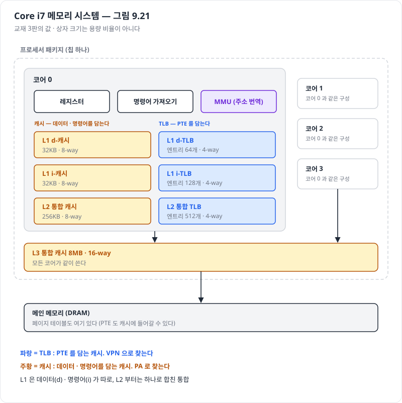
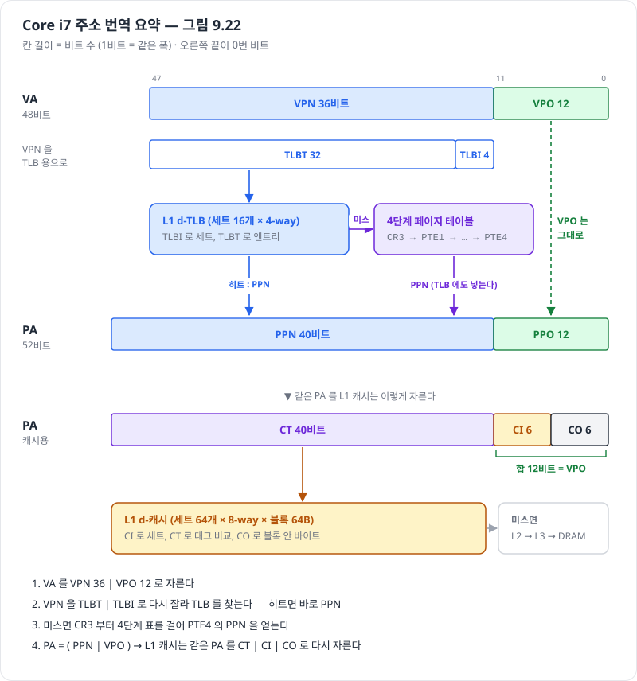
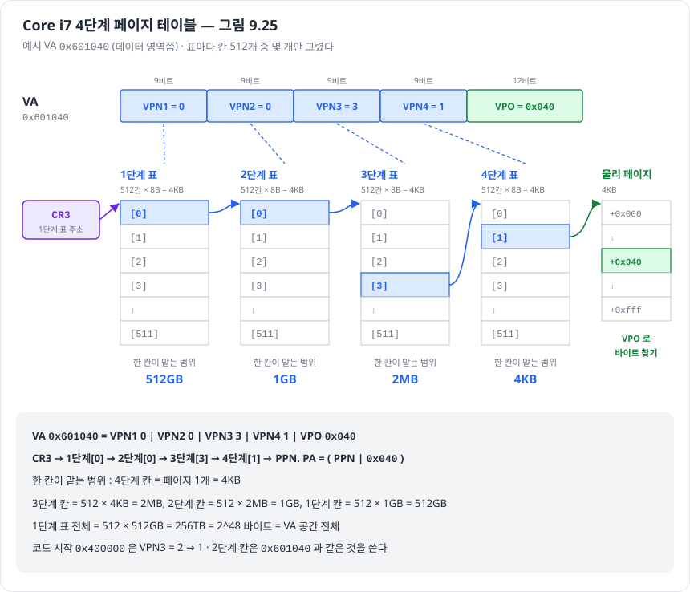
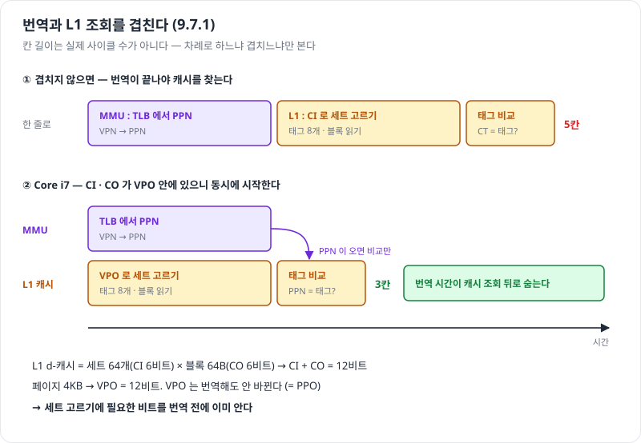
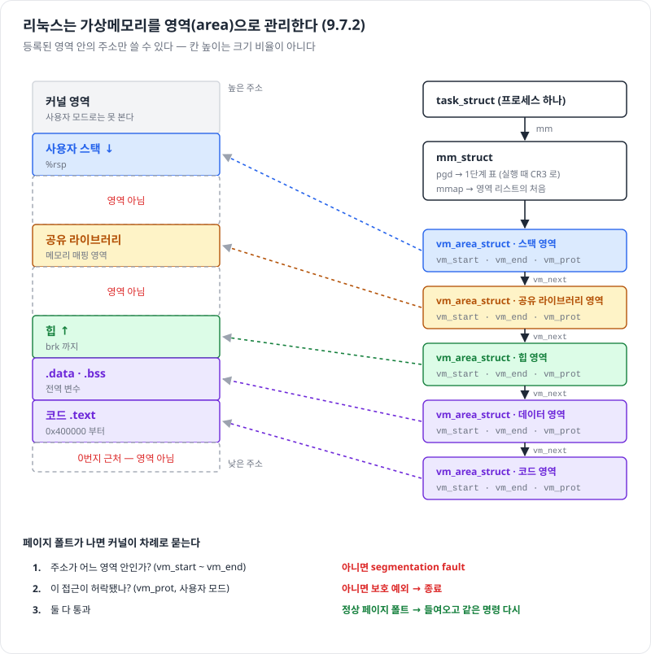

# 9.7 사례 연구 — Intel Core i7 / 리눅스 메모리 시스템

> 진척도 이슈 : [#205](https://github.com/Jongeume/krafton-jungle-2026/issues/205)

> [!NOTE]
> **요약**  
> 9.1 ~ 9.6 의 가상메모리가 **실제 칩(Core i7)과 실제 OS(리눅스)** 에서 어떻게 생겼는지 보는 절.  
> 하드웨어 : 48비트 VA 를 **4단계 페이지 테이블**로 번역하고, TLB 와 캐시를 여러 층으로 둔다.  
> 리눅스 : 가상메모리를 **영역(area)** 단위로 관리하고, 페이지 폴트가 나면 영역 목록으로 주소가 합법인지 먼저 따진다.

- 교재 3판 9.7 기준

- 다음 : [9.8 메모리 매핑](07-memory-mapping.md)

---

## 9.7 들어가며 — Core i7 메모리 시스템 (그림 9.21)

> [!NOTE]
> **요약**  
> 칩 하나에 코어 4개.  
> 코어마다 MMU, TLB 2층, 캐시 2층이 따로 있고, **L3 캐시만 모든 코어가 같이 쓴다.**

> [!TIP]
> **비유**  
> 사무실 건물. 내 책상 서랍(L1) → 우리 층 창고(L2) → 건물 공용 창고(L3) → 바깥 물류센터(DRAM).  
> 물건(데이터)을 찾는 창고와 별개로, "주소 바꾸는 장부"(TLB)도 서랍용 · 층용 두 단계로 따로 둔다.  
> 장부에는 물건이 아니라 **주소만**(PTE) 적혀 있다.

> **이름 읽는 법**  
> - d / i : 데이터용 / 명령어용 (L1 은 둘이 따로)  
> - 통합 : 데이터 · 명령어를 한곳에 (L2 부터)  
> - N-way : 세트 하나에 칸이 N 개

- 주소 크기  
    - VA 48비트 → 번지수 2^48 개 = **256TB**  
    - PA 52비트 → 번지수 2^52 개 = **4PB**  
    - 32비트 프로그램용 호환 모드 : VA 32비트 (4GB)

- 256TB 는 무엇을 세는 값인가  
    - 번지수의 개수 = 바이트 칸의 개수  
    - 실제 DRAM 이 그만큼 있다는 뜻이 아니다

| 이름 | 담는 것 | 크기 | 결합도 |
| --- | --- | --- | --- |
| L1 d-TLB | PTE (데이터 주소용) | 엔트리 64개 | 4-way |
| L1 i-TLB | PTE (명령어 주소용) | 엔트리 128개 | 4-way |
| L2 통합 TLB | PTE | 엔트리 512개 | 4-way |
| L1 d-캐시 | 데이터 | 32KB | 8-way |
| L1 i-캐시 | 명령어 | 32KB | 8-way |
| L2 통합 캐시 | 데이터 · 명령어 | 256KB | 8-way |
| L3 통합 캐시 | 데이터 · 명령어 (코어 공용) | 8MB | 16-way |

- TLB 와 캐시는 둘 다 캐시지만 담는 것이 다르다  
    - TLB : PTE 를 담는다. **VPN** 으로 찾는다  
    - 캐시 : 메모리 내용을 담는다. **PA** 로 찾는다



---

## 9.7.1 Core i7 주소 번역 (그림 9.22 ~ 9.25)

> [!NOTE]
> **요약**  
> VA 48비트 = VPN 36 | VPO 12 (페이지 4KB).  
> VPN 36비트를 **9비트씩 넷**으로 잘라 1 ~ 4단계 표를 차례로 찾는다.  
> 1단계 표의 위치는 **CR3** 레지스터가 갖고 있다.

> [!TIP]
> **비유**  
> 9.6.3 의 "지역 → 동" 두 단계 색인을 네 단계(시 → 구 → 동 → 번지)로 늘린 것.  
> 색인 책자 한 권(표 하나)이 딱 한 쪽(4KB)이라 책장(물리 페이지)에 그대로 꽂힌다.  
> 첫 책자가 어디 꽂혔는지는 CR3 라는 메모 한 장에 적혀 있다.

### 비트 나누기

- 9.6.4 와 같은 일을 숫자만 키워서 한다

| 무엇을 | 어떻게 자르나 | 비트 수가 정해지는 이유 |
| --- | --- | --- |
| VA 48 | VPN 36 \| VPO 12 | 페이지 4KB = 2^12 |
| VPN 36 (TLB 용) | TLBT 32 \| TLBI 4 | L1 TLB 세트 16개 = 2^4 |
| PA 52 | PPN 40 \| PPO 12 | 페이지 4KB |
| PA 52 (캐시용) | CT 40 \| CI 6 \| CO 6 | 세트 64개 = 2^6, 블록 64B = 2^6 |

- L1 TLB 세트 16개는 어디서 나왔나  
    - 엔트리 64개 ÷ 4-way = 세트 16개

- L1 캐시 세트 64개는 어디서 나왔나  
    - 32KB ÷ 8-way ÷ 블록 64B = 세트 64개



### 번역 흐름 — 한 갈래씩

1. CPU 가 VA 를 낸다  
2. MMU 가 VPN 을 TLBT | TLBI 로 잘라 L1 TLB 를 찾는다  
3. TLB 히트 → PPN 을 바로 얻는다  
4. TLB 미스 → CR3 부터 4단계 표를 걸어 PTE4 의 PPN 을 얻고, 그 PTE 를 TLB 에 넣는다  
5. PA = ( PPN | VPO )  
6. L1 캐시가 PA 를 CT | CI | CO 로 잘라 찾는다. 미스면 L2 → L3 → DRAM

- 갈래 셋을 섞지 않는다

| 갈래 | 무엇을 가져오나 | 디스크에 가나 |
| --- | --- | --- |
| TLB 히트 | 아무것도 (TLB 에 이미 PPN) | 아니다 |
| TLB 미스 | PTE 4개를 차례로 읽는다 | 아니다 |
| 페이지 폴트 (PTE 의 P = 0) | 페이지 자체를 디스크에서 | 간다 |

### 4단계 페이지 테이블 (그림 9.25)

- 왜 4단계인가  
    - 한 덩어리 표라면 PTE 2^36 개 × 8B = **512GB** (프로세스마다)  
    - 9.6.3 처럼 쪼개면 안 쓰는 구간의 표를 만들지 않는다

- VA = VPN1 9 | VPN2 9 | VPN3 9 | VPN4 9 | VPO 12

- 왜 하필 9비트씩인가  
    - 표 하나가 **페이지 하나(4KB)** 에 딱 맞게  
    - 4KB ÷ PTE 8B = 512칸 = 2^9 → 칸 번호 9비트

- 한 칸이 맡는 범위 — 작은 것부터  
    1. 4단계 칸 하나 = 페이지 1개 = 4KB  
    2. 3단계 칸 하나 = 4단계 표 하나 = 512 × 4KB = **2MB**  
    3. 2단계 칸 하나 = 512 × 2MB = **1GB**  
    4. 1단계 칸 하나 = 512 × 1GB = **512GB**  
    5. 1단계 표 전체 = 512 × 512GB = 256TB = 2^48 = VA 공간 전체 ✔

- 칸 크기와 맡는 범위를 섞지 않는다  
    - 칸 자체의 크기 : 늘 8B  
    - 칸이 맡는 범위 : 단계마다 다르다 (위 목록)

#### 예 — VA 0x601040 을 끝까지

```
VA 0x601040 = 000000000 | 000000000 | 000000011 | 000000001 | 000001000000
               VPN1 0      VPN2 0      VPN3 3      VPN4 1      VPO 0x040
```

1. CR3 → 1단계 표  
2. 1단계[0] → 2단계 표의 주소  
3. 2단계[0] → 3단계 표의 주소  
4. 3단계[3] → 4단계 표의 주소  
5. 4단계[1] → PPN  
6. PA = ( PPN | 0x040 )

- 확인 : 3단계 칸 3번 = 0번부터 세어 네 번째 2MB 구간 = 6MB ~ 8MB  
    - 0x601040 ≈ 6.004MB → 맞다

- 비교 : 코드 시작 0x400000 = VPN1 0 | VPN2 0 | VPN3 2 | VPN4 0  
    - 1단계[0] · 2단계[0] 은 0x601040 과 같은 칸  
    - 3단계는 같은 표의 다른 칸 (2 vs 3)  
    - → 가까운 주소끼리는 위쪽 표를 같이 쓴다. 그래서 표가 적게 든다



- 안 쓰는 구간  
    - 어느 단계든 PTE 의 P = 0 이면 그 아래 표는 없다 (9.6.3 의 null 과 같다)

### PTE 의 모양 (그림 9.23 · 9.24)

- 1 ~ 3단계 PTE : **다음 단계 표**의 물리 주소 + 비트들

- 4단계 PTE : **물리 페이지**의 주소(PPN) + 비트들

- 주소 칸이 40비트면 충분한 이유  
    - 표와 페이지가 모두 4KB 단위로 놓인다 → 주소의 아래 12비트는 늘 0  
    - 52 − 12 = 40비트만 적으면 된다

- P = 0 일 때  
    - 나머지 비트는 OS 마음대로 쓴다 (예 : 디스크의 어디에 있는지)

| 비트 | 뜻 | 어느 단계 | 누가 쓰나 |
| --- | --- | --- | --- |
| P | 자식 표 · 페이지가 메모리에 있나 | 모두 | 0 이면 페이지 폴트 |
| R/W | 읽기 전용인가 | 모두 | 보호 (9.5) |
| U/S | 사용자 모드로 접근해도 되나 | 모두 | 보호 (9.5) |
| WT | 캐시 쓰기 방식 (write-through / write-back) | 모두 | 하드웨어 |
| CD | 캐시를 쓰지 않음 | 모두 | 하드웨어 |
| A | 참조 비트 — 읽거나 쓰면 MMU 가 켠다 | 모두 | 커널이 희생 페이지를 고를 때 |
| PS | 페이지 크기 4KB / 4MB | 1단계만 | 하드웨어 |
| D | dirty 비트 — 쓰면 MMU 가 켠다 | 4단계만 | 희생 페이지를 디스크에 다시 쓸지 |
| G | global — 문맥 전환 때 TLB 에서 내리지 않는다 | 4단계만 | 커널 페이지 |
| XD | 실행 금지 | 모두 | 데이터 칸에 넣은 코드를 못 돌리게 (버퍼 오버플로 공격 대비) |

- 1 ~ 3단계의 R/W · U/S · XD  
    - 그 칸 **아래에 달린 모든 페이지**에 한꺼번에 적용된다

- A · D 비트  
    - 켜는 쪽 : MMU (하드웨어)  
    - 끄는 쪽 : 커널 (특별한 커널 모드 명령으로)

### CR3 — 1단계 표의 위치

- CR3 = 1단계 표의 **물리 주소**  
    - 페이지 테이블 전체가 아니라 첫 표 하나를 가리킨다

- 프로세스마다 1단계 표가 따로 있다 → CR3 값은 **프로세스 문맥의 일부**  
    - 문맥 전환 때 커널이 CR3 를 새 프로세스의 값으로 바꾼다  
    - 그래서 같은 VA 가 프로세스마다 다른 PA 로 간다 (9.4)

### 번역과 L1 조회를 겹친다 (교재 덧붙임 「주소 번역 최적화」)

> [!NOTE]
> **요약**  
> L1 캐시의 CI + CO = 12비트 = VPO.  
> VPO 는 번역해도 안 바뀌니, **번역이 끝나기 전에** 캐시 세트를 미리 고를 수 있다.

> [!TIP]
> **비유**  
> 택배 기사(L1)가 "몇 동"(PPN)은 아직 모르지만 "몇 호"(VPO)는 이미 안다.  
> 호수로 각 동의 같은 호 후보 8곳을 미리 모아 두고, 동 번호가 오면 맞는 곳 하나만 고른다.

1. CPU 가 VA 를 낸다  
2. 동시에  
    - MMU : TLB 에서 VPN → PPN  
    - L1 : VPO 안의 CI 6비트로 세트를 고르고, 그 세트의 태그 8개 · 블록을 읽어 둔다  
3. PPN 이 오면 → 태그 8개와 비교만 한다



- 왜 딱 맞나  
    - 세트 64개 × 블록 64B = 4KB = 페이지 크기  
    - → 세트 고르기 · 블록 안 위치 = 페이지 안 위치

| 얻는 것 | 내주는 것 |
| --- | --- |
| 번역 시간이 L1 조회 뒤로 숨는다 | L1 을 키우려면 세트 수가 아니라 way 수를 늘려야 한다 (CI + CO ≤ 12비트를 지키려고) |

- 「내주는 것」 칸은 교재 밖 내용 — 확인용으로 적어 둔다

---

## 9.7.2 리눅스 가상 메모리 시스템 (그림 9.26 ~ 9.28)

> [!NOTE]
> **요약**  
> 리눅스는 가상메모리를 **영역(area)** 단위로 관리한다.  
> 영역 = 서로 관련 있는 페이지가 이어진 덩어리 (코드, 데이터, 힙, 공유 라이브러리, 스택).  
> 어느 영역에도 속하지 않은 주소는 없는 주소 → 접근하면 **segmentation fault**.

> [!TIP]
> **비유**  
> 큰 땅(주소공간)을 구역(영역)으로 나눠 등기부(vm_area_struct)에 적어 둔다.  
> 등기부에 없는 땅에 들어가면 무단 침입(segfault).  
> 등기된 구역이라도 "출입 금지(쓰기 금지)" 표시가 있으면 못 들어간다(보호 예외).

### 프로세스의 가상메모리 모양 (그림 9.26)

- 사용자 영역 (아래부터)  
    1. 코드 .text — 0x400000 부터  
    2. 초기화된 데이터 .data  
    3. 0 으로 시작하는 데이터 .bss  
    4. 런타임 힙 — brk 까지, 위로 자란다  
    5. 공유 라이브러리 메모리 매핑 영역  
    6. 사용자 스택 — %rsp, 아래로 자란다

- 커널 영역 (맨 위) — 사용자 모드로는 접근 못 한다

| 모든 프로세스에 같은 부분 | 프로세스마다 다른 부분 |
| --- | --- |
| 커널 코드 · 전역 데이터 | 페이지 테이블 |
| 물리 메모리 전체를 매핑한 구간 | task_struct · mm_struct |
| | 커널 스택 |

- 물리 메모리 전체를 매핑한 구간  
    - DRAM 크기만큼의 **연속된 가상 페이지 ↔ 연속된 물리 페이지**  
    - 왜 : 커널이 물리 메모리의 아무 곳(예 : 페이지 테이블, 메모리 매핑 I/O)이나 쉽게 읽고 쓰려고  
    - 모든 프로세스가 같은 물리 페이지를 가리킨다 → 공유 (9.4)

### 영역 (area)

- 영역 = 이미 할당된 가상메모리 중 **이어져 있고 서로 관련된** 페이지 덩어리  
    - 예 : 코드 영역, 데이터 영역, 힙 영역, 공유 라이브러리 영역, 스택 영역

- 할당된 가상 페이지는 **반드시 어떤 영역 안**에 있다  
    - 영역 밖 페이지는 존재하지 않는다 → 참조할 수 없다

- 왜 영역으로 관리하나  
    - 주소공간에 **빈틈**을 허락할 수 있다  
    - 존재하지 않는 페이지는 커널이 추적하지 않는다  
    - → 메모리 · 디스크 · 커널 자원을 하나도 쓰지 않는다

- 영역을 기억하는 자료구조 (그림 9.27)

```
task_struct (프로세스 하나)
  └ mm → mm_struct          가상메모리의 현재 상태
           ├ pgd  : 1단계 페이지 테이블 주소 → 실행할 때 CR3 에 넣는다
           └ mmap : vm_area_struct 리스트 (영역마다 하나)
                      vm_start : 영역의 처음
                      vm_end   : 영역의 끝
                      vm_prot  : 영역 안 모든 페이지의 읽기 · 쓰기 권한
                      vm_flags : 다른 프로세스와 공유하나, 사적인가 등
                      vm_next  : 다음 영역
```

- task_struct 에는 이것 말고도 PID, 사용자 스택 포인터, 실행 파일 이름, PC 등이 있다

- 권한이 두 군데 있다

| | vm_prot (영역) | PTE 의 R/W · U/S (페이지) |
| --- | --- | --- |
| 단위 | 영역 하나 | 페이지 하나 |
| 누가 보나 | 커널 (폴트 핸들러) | MMU (번역할 때마다) |



### 리눅스 페이지 폴트 처리 (그림 9.28)

> [!NOTE]
> **요약**  
> MMU 가 VA A 를 번역하다 폴트를 내면, 커널 핸들러가 **세 가지를 차례로** 묻는다.  
> 주소가 영역 안인가 → 접근이 허락됐나 → 둘 다 통과면 정상 페이지 폴트.

1. A 가 합법인가? — 어떤 영역의 vm_start ~ vm_end 안인가  
    - 아니면 → **segmentation fault** → 프로세스 종료  
2. 이 접근이 허락됐나? — 영역의 권한으로 읽기 · 쓰기 · 실행을 해도 되나  
    - 아니면 → **보호 예외** → 프로세스 종료  
3. 둘 다 통과 = 정상 페이지 폴트  
    1. 희생 페이지를 고른다  
    2. 수정됐으면 디스크에 쓴다  
    3. 새 페이지를 들여온다  
    4. 페이지 테이블을 고친다  
    5. 핸들러가 돌아오면 CPU 가 **폴트 낸 명령을 다시 실행** → 이번엔 히트

| 그림 9.28 의 경우 | 예 | 결과 |
| --- | --- | --- |
| ① 없는 페이지 접근 | 어느 영역에도 없는 주소를 읽기 | segmentation fault |
| ② 정상 | 데이터 영역의 아직 안 들어온 페이지를 읽기 | 페이지를 들여온다 |
| ③ 권한 위반 | 읽기 전용인 코드 영역에 쓰기 | 보호 예외 |

- 1번 검사를 빨리 하려면  
    - 영역 리스트를 처음부터 훑으면 느리다 (mmap 으로 영역이 얼마든지 늘 수 있다)  
    - 실제 리눅스는 리스트 위에 **트리**를 얹어 찾는다

- 9.5 와 이어 보기  
    - 9.5 : 번역할 때 PTE 권한 비트로 막는다 (하드웨어)  
    - 9.7.2 : 폴트가 난 뒤 영역 정보로 판단한다 (커널)

---

## 헷갈리기 쉬운 것

| 헷갈림 | 바로잡기 |
| --- | --- |
| CR3 = 페이지 테이블 전체 | 1단계 표 하나의 물리 주소 |
| 4단계면 매번 메모리를 4번 더 읽는다 | TLB 히트면 0번. 미스일 때만 PTE 4개 (그 PTE 도 캐시에 있을 수 있다) |
| 1단계 칸 하나 = 512GB 짜리 칸 | 칸 크기는 8B. 512GB 는 그 칸이 **맡는 범위** |
| 페이지 폴트 = segfault | segfault 는 페이지 폴트 중 영역 밖 주소인 경우만 |
| TLB 와 캐시는 같은 것 | TLB = PTE 캐시 (VPN 으로), 캐시 = 메모리 내용 (PA 로) |
