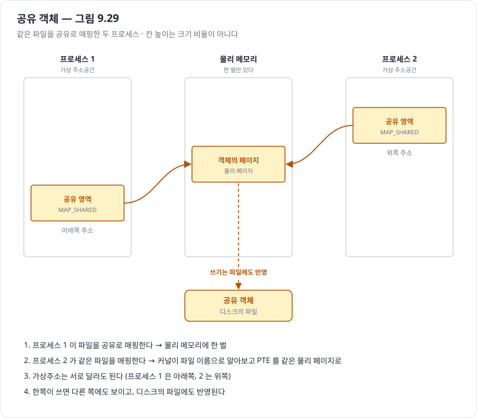
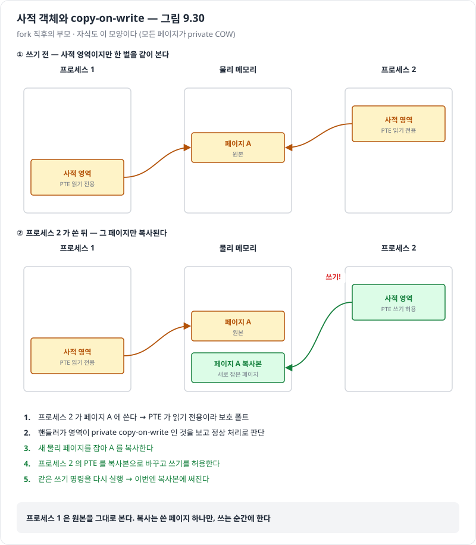
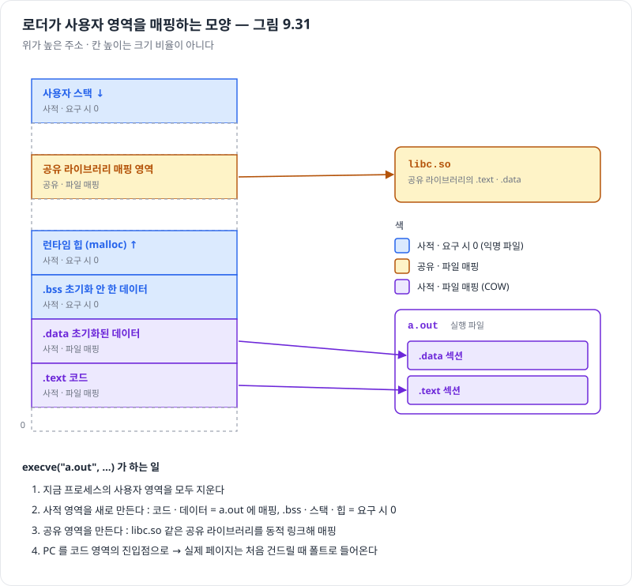
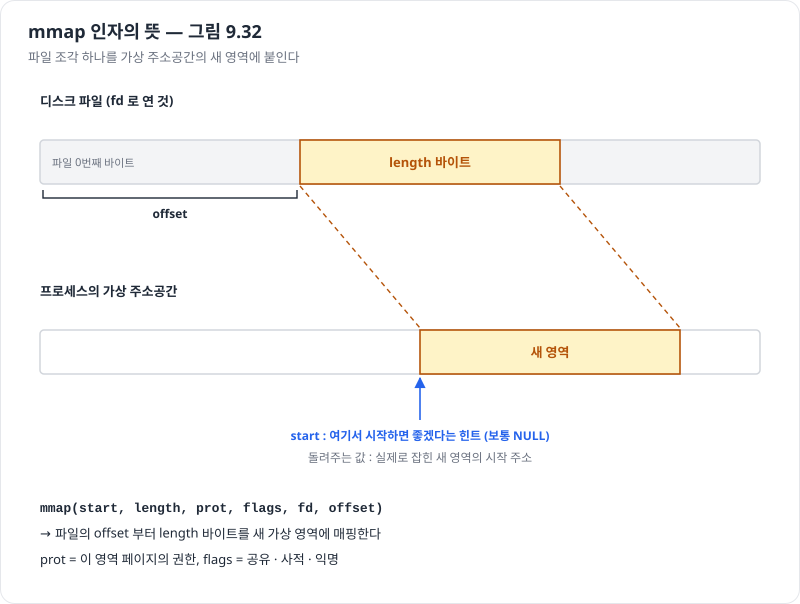

# 9.8 메모리 매핑

> 진척도 이슈 : [#206](https://github.com/Jongeume/krafton-jungle-2026/issues/206)

> [!NOTE]
> **요약**  
> 리눅스는 가상메모리 영역을 만들 때 **디스크의 객체 하나와 연결**해서 그 영역의 처음 내용을 정한다 = 메모리 매핑.  
> 객체는 두 종류다 : 보통 파일(예 : 실행 파일), 아니면 익명 파일(전부 0).  
> 이 한 가지 장치로 공유 객체, fork, execve, mmap 이 모두 설명된다.

> [!TIP]
> **비유**  
> 영역 = 빈 공책. 매핑 = 표지에 "첫 내용은 저 책 몇 쪽부터" 라고 적어 두는 것.  
> 실제로 베끼는 건 그 쪽을 **처음 펼 때**다 (요구 페이징).  
> 익명 파일 = 표지에 "백지로 시작" 이라고 적힌 공책. 펼 때 서고에 갈 필요 없이 빈 종이를 끼운다.

- 교재 3판 9.8 기준

- 앞 : [9.7 사례 — Core i7 · 리눅스](06-case-study-i7-linux.md) (영역 · vm_area_struct · 페이지 폴트 처리)

- 다음 : [9.9 동적 메모리 할당](08-dynamic-memory-allocation.md)

---

## 9.8 들어가며 — 두 종류의 객체

| | 보통 파일 | 익명 파일 |
| --- | --- | --- |
| 무엇 | 디스크에 있는 일반 파일의 이어진 조각 (예 : 실행 파일의 .text) | 커널이 만든, 전부 0 인 파일 |
| 나누는 법 | 파일 조각을 페이지 크기로 잘라 가상 페이지 하나씩의 처음 내용으로 | 페이지마다 0 |
| 처음 건드릴 때 | 그 조각을 디스크에서 읽어 온다 | 희생 페이지를 0 으로 덮어쓴다 (디스크를 읽지 않는다) |
| 영역이 파일 조각보다 크면 | 남는 부분은 0 으로 채운다 | — |
| 다른 이름 | 파일 매핑 (file-backed) | 요구 시 0 페이지 (demand-zero page) |

- 두 경우 모두 **요구 페이징**  
    - 매핑할 때는 아무것도 읽지 않는다  
    - CPU 가 그 페이지를 처음 건드릴 때 페이지 폴트로 들어온다

- 익명 파일의 첫 접근 흐름  
    1. 커널이 물리 메모리에서 희생 페이지를 고른다  
    2. 희생 페이지가 수정됐으면 디스크에 쓴다  
    3. 그 페이지를 0 으로 덮어쓴다  
    4. 페이지 테이블에 "메모리에 있음" 으로 적는다  
    - → 디스크와 메모리 사이에 실제로 오간 데이터가 없다

- 한 번 초기화된 페이지는 그 뒤  
    - 커널이 관리하는 **스왑 파일**(스왑 공간)과 DRAM 사이를 오간다  
    - 원래 파일로 돌아가는 게 아니다

- 스왑 공간의 크기  
    - = 지금 실행 중인 프로세스들이 할당할 수 있는 가상 페이지 총량의 **한도**

---

## 9.8.1 공유 객체 다시 보기 (그림 9.29 · 9.30)

> [!NOTE]
> **요약**  
> 같은 객체를 **공유**로 매핑하면 한쪽의 쓰기가 다른 쪽에도 보이고 디스크 파일에도 반영된다.  
> **사적**으로 매핑하면 남에게 안 보이고 파일에도 안 간다.  
> 사적 매핑은 copy-on-write 로 구현한다 — 쓰기 전까지는 한 벌을 같이 쓴다.

> [!TIP]
> **비유**  
> 공유 = 같은 공유 문서를 둘이 편집한다. 고친 게 서로 보이고 원본이 바뀐다.  
> 사적 COW = 같은 원본 책을 둘이 같이 보다가, 한 사람이 어느 쪽에 밑줄을 그으려는 순간 **그 쪽만** 복사해서 자기 사본에 긋는다.  
> 다른 사람은 여전히 깨끗한 원본을 본다.

| | 공유 객체 | 사적 객체 |
| --- | --- | --- |
| 쓰기가 다른 프로세스에 | 보인다 | 안 보인다 |
| 쓰기가 디스크 파일에 | 반영된다 | 반영 안 된다 |
| 물리 메모리 | 늘 한 벌 | 처음엔 한 벌, 쓴 페이지만 따로 복사 |
| 그 영역의 이름 | 공유 영역 | 사적 영역 |

### 공유 객체 (그림 9.29)

1. 프로세스 1 이 파일을 공유로 매핑한다 → 물리 메모리에 한 벌이 들어온다  
2. 프로세스 2 가 같은 파일을 공유로 매핑한다  
3. 파일 이름은 하나뿐이라, 커널은 "이미 프로세스 1 이 매핑한 객체" 임을 바로 안다  
4. 프로세스 2 의 PTE 를 **같은 물리 페이지**로 채운다

- 가상주소는 프로세스마다 달라도 된다  
    - 같은 것은 물리 페이지다 (9.4 의 공유)



### 사적 객체와 copy-on-write (그림 9.30)

- 처음은 공유 객체와 같다  
    - 두 프로세스가 같은 물리 페이지 한 벌을 본다

- 준비 — 사적 객체를 매핑할 때  
    - 그 영역의 PTE : **읽기 전용**  
    - 그 영역의 vm_area_struct : **private copy-on-write** 표시

- 아무도 쓰지 않으면 끝까지 한 벌을 같이 쓴다

- 누가 쓰면  
    1. 쓰기 → PTE 가 읽기 전용이라 **보호 폴트**  
    2. 핸들러가 영역이 private COW 인 것을 보고 정상 처리로 판단한다  
    3. 물리 메모리에 그 페이지의 **새 복사본**을 만든다  
    4. 쓴 프로세스의 PTE 를 복사본으로 바꾸고 **쓰기를 허용**한다  
    5. 핸들러가 돌아오면 CPU 가 같은 쓰기 명령을 다시 실행 → 이번엔 복사본에 써진다



- 9.7.2 의 폴트 처리와 이어 보기  
    - 겉모습은 2번 검사의 "권한 위반" 이다  
    - 그런데 영역이 private COW 라서 프로세스를 끝내지 않고 복사해 준다

| 얻는 것 | 내주는 것 |
| --- | --- |
| 안 쓰는 페이지는 끝까지 복사하지 않는다 → 물리 메모리를 아낀다 | 처음 쓰는 순간에 폴트 + 페이지 복사 비용을 낸다 |

---

## 9.8.2 fork 함수 다시 보기

> [!NOTE]
> **요약**  
> fork 는 부모의 mm_struct, 영역 struct, 페이지 테이블만 복사하고 **페이지 내용은 복사하지 않는다.**  
> 양쪽 모든 페이지를 읽기 전용 + private COW 로 표시해 두고, 쓰는 순간 그 페이지만 복사한다.

> [!TIP]
> **비유**  
> 부모 공책을 자식에게 "같이 보기" 로 넘긴다.  
> 누가 한 쪽을 고치려 하면 그 쪽만 복사해서 각자 가진다.

1. 커널이 새 프로세스의 자료구조를 만들고 새 PID 를 준다  
2. 부모의 mm_struct, 영역 struct, 페이지 테이블의 **복사본**을 만든다  
3. 양쪽 모든 페이지를 읽기 전용으로, 양쪽 모든 영역을 private COW 로 표시한다  
4. fork 가 자식에서 돌아오면, 자식의 가상메모리는 fork 직전 부모와 똑같다  
5. 이후 어느 쪽이든 쓰면 COW 로 새 페이지가 생긴다 → 각자 사적 주소공간을 지킨다

- 작은 예

```c
int x = 1;
if (fork() == 0)
    x = 2;      /* 자식만 x 를 바꾼다 */
```

- fork 직후  
    - x 가 든 페이지 : 물리 메모리에 한 벌  
    - 부모 · 자식 PTE : 둘 다 읽기 전용

- 자식이 x = 2  
    1. 보호 폴트  
    2. 그 페이지 하나만 복사  
    3. 자식 PTE → 복사본, 쓰기 허용  
    4. 복사본의 x 가 2 가 된다

- 부모의 x 는 여전히 1  
    - 부모 PTE 는 원본을 가리킨다

- 그림은 위 그림 9.30 과 같다 (프로세스 1 = 부모, 프로세스 2 = 자식)

---

## 9.8.3 execve 함수 다시 보기 (그림 9.31)

> [!NOTE]
> **요약**  
> execve 는 지금 사용자 영역을 지우고 새 프로그램의 영역을 **매핑만** 한다.  
> 코드 · 데이터는 실행 파일에, .bss · 스택 · 힙은 익명 파일에 매핑한다.  
> 실제 페이지는 처음 건드릴 때 폴트로 들어온다.

> [!TIP]
> **비유**  
> 이사. 옛 짐을 다 빼고 새 집의 배치도(영역)만 그려 둔다.  
> 가구(페이지)는 그 방을 처음 쓸 때 가져온다.

- `execve("a.out", NULL, NULL)` 를 부르면

1. **사용자 영역을 지운다**  
    - 지금 프로세스 가상주소의 사용자 부분에 있던 영역 struct 를 모두 지운다  
2. **사적 영역을 만든다** — 모두 private COW  
    - 코드 · 데이터 영역 : a.out 의 .text · .data 섹션에 매핑  
    - .bss 영역 : 요구 시 0, 익명 파일에 매핑 (크기는 a.out 에 적혀 있다)  
    - 스택 · 힙 영역 : 요구 시 0, 처음 길이는 0  
3. **공유 영역을 만든다**  
    - libc.so 같은 공유 라이브러리를 동적 링크한 뒤, 사용자 주소공간의 공유 영역에 매핑  
4. **PC 를 맞춘다**  
    - 코드 영역의 진입점을 가리키게 한다

- 다음에 이 프로세스가 스케줄되면 진입점부터 실행한다  
    - 코드 · 데이터 페이지는 필요할 때 리눅스가 들여온다

| 영역 | 사적 / 공유 | 무엇에 매핑 |
| --- | --- | --- |
| 사용자 스택 | 사적 | 익명 (요구 시 0) |
| 공유 라이브러리 | 공유 | libc.so 의 .text · .data |
| 런타임 힙 | 사적 | 익명 (요구 시 0) |
| .bss | 사적 | 익명 (요구 시 0) |
| .data | 사적 | a.out 의 .data |
| .text | 사적 | a.out 의 .text |



- .data 가 사적인 이유  
    - 전역 변수를 고쳐도 a.out 파일이 바뀌면 안 된다 → COW

- fork 와 묶어 보기  
    - fork : 주소공간을 **복사한 척**한다 (COW)  
    - execve : 주소공간을 **새로 매핑**한다  
    - 쉘이 프로그램을 띄울 때 = fork 다음에 자식이 execve

---

## 9.8.4 mmap 함수로 사용자 수준 메모리 매핑 (그림 9.32)

> [!NOTE]
> **요약**  
> 프로그램이 직접 영역을 만들 수 있다.  
> mmap = 파일의 한 조각을 새 가상 영역에 붙인다, munmap = 영역을 지운다.

> [!TIP]
> **비유**  
> 내가 직접 공책을 한 권 추가하고 표지에 "첫 내용은 이 파일의 이 부분" 이라고 적는다.  
> munmap = 그 공책을 버린다. 버린 공책을 펴려 하면 segfault.

```c
#include <unistd.h>
#include <sys/mman.h>

void *mmap(void *start, size_t length, int prot, int flags,
           int fd, off_t offset);
/* 성공 : 새 영역의 시작 주소,  실패 : MAP_FAILED (-1) */

int munmap(void *start, size_t length);
/* 성공 : 0,  실패 : -1 */
```

| 인자 | 뜻 |
| --- | --- |
| start | 여기서 시작하면 좋겠다는 **힌트** (보통 NULL) |
| length | 매핑할 바이트 수 |
| fd | 매핑할 파일 (열어 둔 것) |
| offset | 파일 처음부터 몇 바이트 떨어진 곳부터 |
| prot | 새 영역 페이지의 권한 (vm_prot 로 들어간다) |
| flags | 어떤 객체로 매핑하나 |



| prot | 뜻 |
| --- | --- |
| PROT_EXEC | 페이지의 명령을 실행할 수 있다 |
| PROT_READ | 읽을 수 있다 |
| PROT_WRITE | 쓸 수 있다 |
| PROT_NONE | 아무 접근도 안 된다 |

| flags | 뜻 |
| --- | --- |
| MAP_ANON | 익명 객체 → 요구 시 0 페이지 |
| MAP_PRIVATE | 사적 copy-on-write 객체 |
| MAP_SHARED | 공유 객체 |

- 예

```c
bufp = Mmap(NULL, size, PROT_READ, MAP_PRIVATE | MAP_ANON, 0, 0);
```

- 이 호출이 만드는 영역  
    - 크기 : size 바이트  
    - 권한 : 읽기 전용  
    - 사적, 요구 시 0  
    - 성공하면 bufp 가 그 영역의 시작 주소

- `Mmap` 은 교재 csapp.c 의 감싼 함수 (에러를 대신 검사)

- munmap  
    - start 부터 length 바이트의 영역을 지운다  
    - 그 뒤 그 주소를 참조하면 segfault (영역 밖 = 9.7.2 의 1번 검사)

- 9.9 와 이어 보기  
    - mmap · munmap 으로도 메모리를 얻고 돌려줄 수 있다  
    - 그래도 C 프로그래머는 보통 더 편하고 이식성 좋은 동적 할당기(malloc)를 쓴다 → [9.9 동적 메모리 할당](08-dynamic-memory-allocation.md)

- 연습문제 9.5 : mmap 으로 아무 크기의 파일을 stdout 에 복사하는 `mmapcopy.c`  
    - 답은 적지 않았다 — 직접 풀어 볼 것

---

## 네 절을 한 줄로

| 절 | 무엇을 매핑하나 | 쓰면 |
| --- | --- | --- |
| 9.8.1 공유 객체 | 파일을 공유로 | 다른 프로세스 · 파일에 보인다 |
| 9.8.1 사적 객체 | 파일을 사적으로 | 그 페이지만 복사 (COW) |
| 9.8.2 fork | 부모의 영역 전부를 사적 COW 로 | 쓴 쪽만 새 페이지 |
| 9.8.3 execve | 새 프로그램의 섹션 · 익명 파일 | .data 등은 COW |
| 9.8.4 mmap | 내가 고른 파일 조각 · 익명 | flags 에 따라 |

## 헷갈리기 쉬운 것

| 헷갈림 | 바로잡기 |
| --- | --- |
| 매핑하면 파일을 메모리로 읽어 온다 | 매핑은 연결만. 읽는 건 처음 건드릴 때 (요구 페이징) |
| 익명 파일 = 디스크 어딘가의 0 파일을 읽는다 | 디스크를 읽지 않는다. 희생 페이지를 0 으로 덮어쓴다 |
| fork 는 부모 메모리를 통째로 복사한다 | 표만 복사. 페이지는 쓰는 순간 그 페이지만 |
| 사적 매핑 = 처음부터 따로 한 벌씩 | 처음엔 한 벌을 같이 본다. 쓸 때 복사 |
| COW 의 보호 폴트 = 프로세스 종료 | 영역이 private COW 면 복사해 주고 계속 실행 |
| 쫓겨난 힙 페이지는 원래 파일로 돌아간다 | 스왑 공간으로 간다 |
