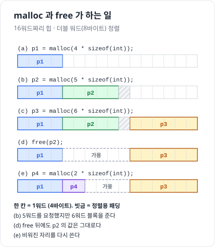
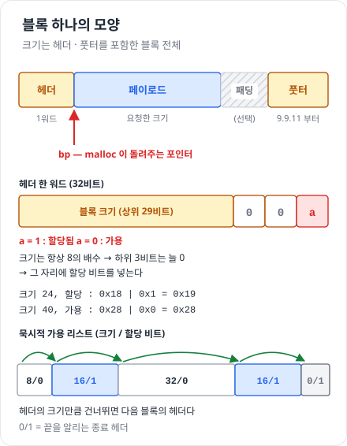
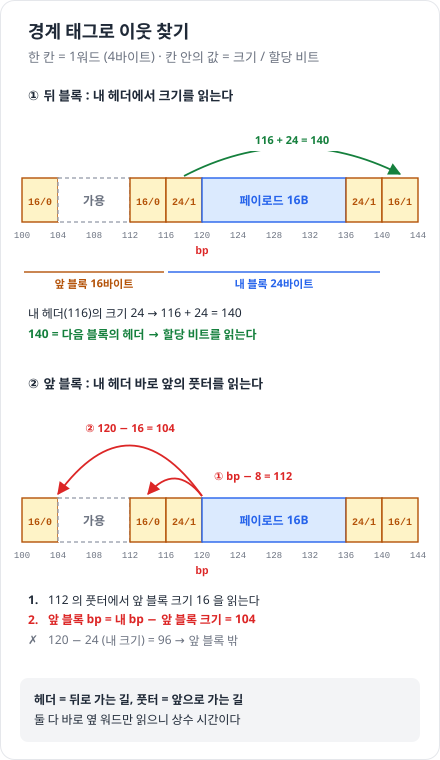
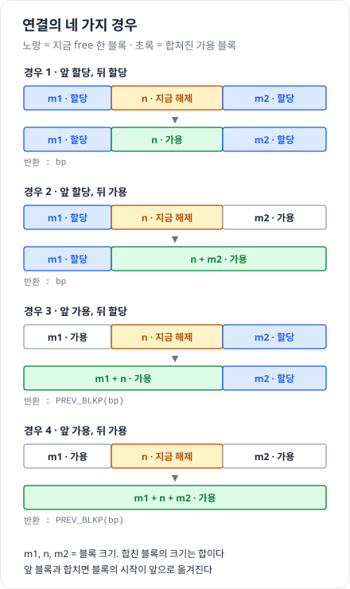
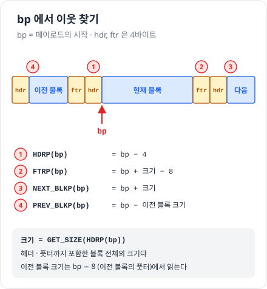
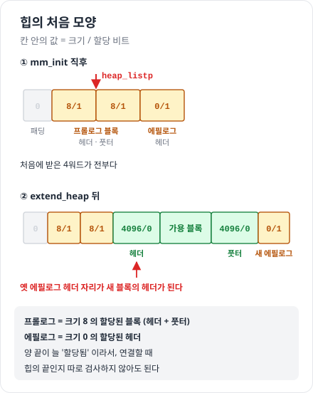

# 9.9 동적 메모리 할당

> 진척도 이슈 : [#207](https://github.com/Jongeume/krafton-jungle-2026/issues/207)

> [!NOTE]
> **한 줄**  
> 할당기는 **힙을 블록으로 잘라 쓴다.**  
> 블록이 쓰이는 중인지 비었는지는 **블록 안에 적어 둔다.**  
> malloc 은 빈 블록을 찾아 주고, free 는 비었다고 표시한 뒤 옆 빈 블록과 합친다.

- 이어지는 곳 : malloc-lab ([`weekly/week6/malloc-lab`](../../../weekly/week6/malloc-lab), `-m32` 빌드)

---

## 9.9 힙과 할당기

> [!NOTE]
> **요약**  
> 힙 = .bss 바로 위에서 시작해 **위로 자라는** 영역.  
> 커널이 힙의 꼭대기를 `brk` 로 기억한다.

> [!TIP]
> **비유**  
> 힙 = 한 줄로 늘어선 긴 창고 선반.  
> 할당기는 요청이 올 때마다 선반을 잘라 칸을 내준다.  
> 선반 끝(brk)이 모자라면 건물주(커널)에게 선반을 더 달라고 한다 = sbrk.


- 블록 상태는 둘 중 하나  
    - 할당  
    - 가용(free)

- 할당기 종류  
    - **명시적** : 프로그램이 직접 반환한다 — C 의 malloc / free  
    - **묵시적** : 안 쓰는 블록을 알아서 회수한다 — 가비지 컬렉터 (자바 · C#)

- 9.9 는 명시적 할당기만 다룬다

- 할당기를 쓰는 이유 : 더 **편리**하고 **이식성**이 좋다.  
    - 이식성 = 다른 시스템으로 옮겨도 그대로 돌아간다

- mmap 을 직접 쓰지 않는 이유 (교재 밖)  
    - mmap 은 **페이지(4KB) 단위**로만 준다  
    - 12바이트가 필요해도 4096바이트 영역이 생긴다  
    - 할당기는 큰 덩어리를 한 번 받아 **작게 잘라** 나눠 준다

|       | mmap 직접                 | 할당기 (malloc)              |
| ----- | ----------------------- | ------------------------- |
| 얻는 것  | 영역마다 따로 만들고 지운다         | 바이트 단위로 잘라 쓴다 (시스템 콜이 적다) |
| 내주는 것 | 작은 요청도 한 페이지 (매번 시스템 콜) | 블록마다 헤더 같은 관리 정보 (단편화)    |

---

## 9.9.1 malloc 과 free

> [!NOTE]
> **요약**  
> malloc 은 **"적어도 이만큼, 정렬된 블록"** 을 약속한다.  
> free 는 아무것도 약속하지 않는다.  
> 할당기가 메모리를 받아 오는 길은 **sbrk 또는 mmap** 둘이다.

> [!TIP]
> **비유**  
> malloc = 보관소 창구.  
> "적어도 이만큼"인 칸을 주고, 칸의 시작은 규격(정렬)에 맞춘다.  
> free = 칸 반납.  
> 창구는 영수증도 경고도 주지 않는다.  
> 반납한 칸 번호를 계속 들고 다시 써도 아무도 말리지 않는다 = UAF.

### malloc

```c
void *malloc(size_t size);
```

- 돌려주는 블록 : **적어도** size 바이트 (딱 그 크기가 아닐 수 있다)

- 정렬  
    - 32비트 모드 : 주소가 8 의 배수  
    - 64비트 모드 : 주소가 16 의 배수

- 실패하면 : NULL + errno 설정

- 메모리를 **초기화하지 않는다** — 있던 값이 그대로

### calloc · realloc

- calloc : 0 으로 채워서 돌려준다w  
- realloc : 이미 받은 블록의 크기를 바꾼다

### free

```c
void free(void *ptr);
```

- ptr 은 malloc · calloc · realloc 이 돌려준 **블록의 시작 주소**여야 한다  
    - 아니면 결과가 정해져 있지 않다

- **돌려주는 값이 없다** → 잘못 써도 알려주지 않는다  
    - 5주차 gdb 문제(UAF, double free)가 전부 여기서 나온다

### sbrk

```c
void *sbrk(intptr_t incr);
```

- 이름 풀이  
    - **sbrk** (set break) : break 를 옮긴다  
    - **brk** (break) : 힙이 끝나는 경계 — 리눅스 man 페이지 용어로 program break  
    - **incr** (increment) : 늘릴 양 (바이트, 음수면 줄인다)

- 커널의 brk 에 incr 을 더해 힙을 늘리거나 줄인다  
- 성공 : **옛 brk** 를 돌려준다 = 새로 생긴 영역의 시작  
- 실패 : −1, errno = ENOMEM  
- incr = 0 : 현재 brk 를 돌려준다

- 예 : brk = 1000 일 때  
    1. sbrk(24) → 1000 을 돌려준다  
    2. brk = 1024 가 된다  
    3. 할당기는 1000 ~ 1023 을 새 블록으로 쓴다

### 메모리를 받아 오는 두 방법 — sbrk 또는 mmap

- 할당기는 mmap · munmap 으로 힙 메모리를 받고 돌려주**거나**, sbrk 를 쓴다  
    - 둘을 함께 쓴다는 말이 아니라, 방법이 **두 가지**라는 말  
    - 교재 구현(9.9.12)은 sbrk 쪽 (랩에서는 mem_sbrk)

```c
void *mmap(void *start, size_t length, int prot, int flags, int fd, off_t offset);
int munmap(void *start, size_t length);
```

- mmap (9.8.4) : **새 가상메모리 영역**을 만든다  
    - start : 원하는 시작 주소 — 힌트일 뿐, 보통 NULL  
    - prot : 접근 권한 — PROT_READ, PROT_WRITE, PROT_EXEC, PROT_NONE  
    - flags : MAP_ANON 이면 파일 없는 **익명 영역** (0 으로 채워진 페이지)  
    - 성공 : 영역의 시작 주소  
    - 실패 : MAP_FAILED (−1)

- munmap : start 부터 length 바이트의 영역을 지운다  
    - 지운 뒤 그 주소에 접근하면 segmentation fault

| | sbrk | mmap |
| --- | --- | --- |
| 늘어나는 곳 | 힙 끝에 이어 붙는다 | 아무 데나 새 영역 |
| 돌려주기 | 끝에서만 줄인다 (가운데 빈 곳은 못 돌려준다) | 영역마다 따로 munmap |
| 단위 | 바이트 | 페이지 (4KB) |

- 실제 glibc malloc 은 둘 다 쓴다 (교재 밖)  
    - 작은 요청 : sbrk 로 늘린 힙에서 잘라 준다  
    - 큰 요청 (기본 128KB 이상) : mmap 으로 따로 받고, free 하면 munmap 으로 바로 돌려준다

### 예시



- (b) 5워드 요청 → 6워드를 준다  
    - 정렬을 맞추려고 덧붙인 것

- (d) free 뒤에도 p2 는 같은 주소를 들고 있다  
    - 다시 쓰지 않는 것은 프로그램의 책임

---

## 9.9.2 왜 동적 할당인가

> [!NOTE]
> **요약**  
> 프로그램은 **실행해 봐야** 자료구조의 크기를 아는 경우가 많다.  
> 고정 크기 배열은 넘치면 다시 컴파일해야 하고, malloc 은 가상메모리가 허락하는 만큼 받는다.

> [!TIP]
> **비유**  
> 고정 크기 = 개업 전에 식당 테이블 수를 못 박아 두기.  
> 손님이 더 오면 가게를 다시 지어야 한다 (다시 컴파일).  
> malloc = 손님이 온 만큼 그때그때 테이블을 꺼내 놓기.

- 고정 크기 버전

```c
#define MAXN 15213
int array[MAXN];      /* 크기가 컴파일 때 정해진다 */
```

- MAXN 은 **임의로 고른 값**  
    - 이 컴퓨터에서 실제로 쓸 수 있는 가상메모리 양과 아무 관계가 없다  
    - 입력 n = 20000 → 넘친다 → MAXN 을 키워 다시 컴파일  
    - 입력 n = 10 → 15203칸이 그냥 논다  
    - 이런 값이 많은 큰 프로그램은 관리하기 악몽 (원문)

- malloc 버전

```c
scanf("%d", &n);
array = (int *)malloc(n * sizeof(int));   /* 크기가 실행 때 정해진다 */
```

- 최대 크기는 **가용 가상메모리 양**에만 제한된다

| | 고정 크기 배열 | malloc |
| --- | --- | --- |
| 얻는 것 | 단순하다 (할당 비용이 없다) | 실행 때 필요한 만큼만 받는다 |
| 내주는 것 | 넘치면 다시 컴파일, 작으면 낭비 | 할당 · 반환 비용 (free 를 잊으면 누수) |

---

## 9.9.3 ~ 9.9.4 요구사항 · 목표 · 단편화

> [!NOTE]
> **요약**  
> 지켜야 할 것 다섯, 노리는 것 둘.  
> 노리는 둘(처리량 · 이용도)은 서로 부딪친다.

> [!TIP]
> **비유**  
> 내부 단편화 = 큰 상자에 작은 물건을 넣어 남는 공간.  
> 외부 단편화 = 영화관에 빈자리가 6개 남았는데 한 칸씩 떨어져 있어서, 나란히 앉을 4명 일행을 받지 못한다.  
> 이미 앉은 관객을 옮길 수는 없다.

### 지켜야 할 것

1. 요청이 **어떤 순서로 와도** 처리한다  
2. 요청에 **바로 응답**한다 — 순서를 바꾸거나 모아 둘 수 없다  
3. **힙만** 쓴다 — 할당기 자신의 자료구조도 힙 안에  
4. 블록을 **정렬**한다  
5. 할당한 블록은 **건드리지 않는다** — 옮기거나 줄일 수 없다

### 노리는 것

| | 처리량 | 메모리 이용도 |
| --- | --- | --- |
| 뜻 | 단위 시간에 끝내는 요청 수 | **최대 이용도** = 지금까지 페이로드 합의 최댓값 ÷ 힙 크기 |
| 높이려면 | 대충 넣어야 한다 | 오래 찾아야 한다 |

- 둘은 부딪친다 — 한쪽을 높이는 방법이 다른 쪽을 깎는다

### 단편화 — 이용도가 떨어지는 이유

| | 내부 단편화 | 외부 단편화 |
| --- | --- | --- |
| 뜻 | 블록이 페이로드보다 크다 | 빈 메모리의 합은 충분한데 한 블록으로는 모자란다 |
| 원인 | 최소 블록 크기, 정렬 패딩 | 빈 블록이 띄엄띄엄 흩어져 있다 |
| 셀 수 있나 | 지금까지의 요청만 보면 셀 수 있다 | 앞으로 올 요청에 달려 있어서 세기 어렵다 |

- 그래서 할당기는 **작은 빈 블록 여러 개보다 큰 빈 블록 몇 개**를 남기려 한다

---

## 9.9.6 묵시적 가용 리스트 — 빈 블록 알아보기

> [!NOTE]
> **요약**  
> 블록마다 맨 앞에 **헤더**를 두고, 크기와 할당 여부를 적는다.  
> 크기만큼 건너뛰면 다음 블록이라 힙 전체가 리스트처럼 이어진다.

> [!TIP]
> **비유**  
> 칸마다 앞에 "크기 · 사용 중" 꼬리표(헤더)를 붙인다.  
> 꼬리표에 적힌 크기만큼 걸어가면 다음 칸의 꼬리표다.  
> 빈 칸을 찾으려면 사용 중인 칸까지 전부 지나가야 한다.



- 블록 구성  
    - **헤더** : 1워드 — 블록 크기 + 할당 비트  
    - **페이로드** : 프로그램이 쓰는 부분 — malloc 이 돌려주는 포인터가 여기를 가리킨다  
    - **패딩** : 정렬을 맞추려고 남기는 부분

- 할당 비트를 넣을 자리  
    - 정렬 8바이트 → 블록 크기는 늘 8 의 배수  
    - 8 의 배수는 하위 3비트가 늘 0 → 그 자리에 할당 비트

### 블록 크기 계산 (연습문제 9.6)

1. 요청 크기에 헤더 4바이트를 더한다  
2. 8 의 배수로 올린다  
3. 헤더 값 = 블록 크기 | 1

| 요청 | + 헤더 | 블록 크기 | 헤더 값 |
| ---: | ---: | ---: | --- |
| malloc(1) | 5 | 8 | 0x9 |
| malloc(5) | 9 | 16 | 0x11 |
| malloc(12) | 16 | 16 | 0x11 |
| malloc(13) | 17 | 24 | 0x19 |
| malloc(15) | 19 | 24 | 0x19 |

- 16 이 안 되는 이유 (malloc(15))  
    - 16바이트 블록에서 헤더 4를 빼면 페이로드 자리는 12바이트  
    - 15바이트가 안 들어간다

### bp — 블록 포인터

- **bp**(block pointer) = 블록의 **페이로드가 시작하는 주소**  
    - 헤더 바로 다음 칸  
    - malloc 이 돌려주는 주소가 바로 이것

- brk 와 다른 것  
    - 이름이 둘 다 b 로 시작해서 헷갈린다

| | bp | brk |
| --- | --- | --- |
| 뜻 | block pointer | 커널이 기억하는 **힙의 끝** |
| 가리키는 곳 | 블록 **하나**의 페이로드 시작 | 힙 **전체**의 맨 위 |
| 개수 | 블록마다 하나 | 프로세스에 하나 |
| 움직이는 법 | 블록 크기만큼 건너뛴다 (`NEXT_BLKP`) | `sbrk(incr)` 로 늘린다 |

- 예시 : 힙이 주소 0 에서 시작, 16바이트 블록 두 개

```
주소   0          4              16         20             32
       [헤더 16/1][페이로드 12B ][헤더 16/1][페이로드 12B ]
                  ↑                         ↑              ↑
               bp = 4                    bp = 20        brk = 32
```

- 첫 블록 bp = 4 : 헤더 4바이트를 건너뛴 자리  
- 둘째 블록 bp = 20 : 4 + 16 (첫 블록 크기)  
- brk = 32 : 힙이 끝나는 자리 — 어느 블록의 것도 아니다

| 얻는 것 | 내주는 것 |
| --- | --- |
| malloc 이 bp 를 그대로 돌려줄 수 있다 | 헤더를 읽으려면 한 칸 뒤로 간다 (`HDRP(bp)` = bp − 4) |

| 얻는 것 | 내주는 것 |
| --- | --- |
| 단순하다 | 빈 블록을 찾으려면 **할당된 블록까지 전부** 지나간다 (전체 블록 수에 비례) |

---

## 9.9.7 ~ 9.9.9 배치 · 분할 · 힙 늘리기

> [!NOTE]
> **요약**  
> 찾는 방법이 셋이고, 찾은 블록이 크면 잘라 쓴다.  
> 그래도 없으면 합쳐 보고, 안 되면 힙을 늘린다.

> [!TIP]
> **비유**  
> 주차 자리 찾기.  
> first fit = 입구부터 보이는 첫 빈자리.  
> next fit = 지난번 세운 곳부터.  
> best fit = 다 둘러보고 가장 딱 맞는 자리.  
> 분할 = 큰 자리에 작은 차를 세우고 남는 뒷부분을 새 빈자리로 칠한다.

### 배치 정책

| 정책            | 어디서부터 · 무엇을            | 얻는 것             | 내주는 것                  |
| ------------- | ---------------------- | ---------------- | ---------------------- |
| **first fit** | 처음부터, 맞는 첫 블록          | 큰 블록이 뒤쪽에 남는다    | 앞쪽에 작은 조각이 쌓여 탐색이 길어진다 |
| **next fit**  | 지난번에 멈춘 곳부터            | first fit 보다 빠르다 | 이용도는 나쁘다고 알려져 있다       |
| **best fit**  | 전부 살펴, 맞는 것 중 가장 작은 블록 | 이용도가 좋다          | 힙 전체를 훑어야 한다           |

- 예 : 가용 블록이 주소 순으로 [24] [16] [32], 요청 블록 크기 16  
    - first fit → 24 를 골라 16 을 쓰고 8 이 남는다 (분할)  
    - best fit → 16 을 골라 딱 맞는다  
    - next fit → 지난번에 멈춘 곳이 32 앞이었다면 32 를 고른다

### 분할

- 찾은 블록이 요청보다 크면 둘 중 하나  
    - 통째로 준다 → 남는 만큼 내부 단편화  
    - **분할**한다 → 앞은 할당 블록, 뒤는 새 가용 블록

### 그래도 없으면

1. 옆에 붙은 빈 블록들을 합쳐 본다  
2. 안 되면 sbrk 로 힙을 더 받는다  
    - 받은 메모리 = 큰 가용 블록 하나

---

## 9.9.10 ~ 9.9.11 연결과 경계 태그

> [!NOTE]
> **요약**  
> 옆 블록이 비었으면 합친다 (**연결**).  
> 앞 블록을 보려면 블록 끝에 **풋터**가 필요하다.

> [!TIP]
> **비유**  
> 빈 칸이 붙어 있으면 칸막이를 떼서 한 칸으로 합친다.  
> 칸 뒤쪽에도 같은 꼬리표(풋터)를 붙여 두면, 내 칸 앞에 서서 바로 앞 칸의 꼬리표를 읽을 수 있다.

- 왜 합치나 : 빈 블록이 붙어 있으면 합은 충분해도 큰 요청을 못 준다  
    - 이렇게 붙어 있는데 못 쓰는 상태를 **오류 단편화**(false fragmentation)라 한다

- 언제 합치나  
    - **즉시 연결** : free 할 때마다 바로 앞뒤를 합친다  
        - 경계 태그가 있으면 상수 시간  
        - 예 : 같은 크기를 malloc → free → malloc 반복하면, free 때 합치고 다음 malloc 때 다시 쪼갠다 (원문 thrashing)  
    - **지연 연결** : 나중으로 미뤘다가 한꺼번에  
        - 예 : 할당이 실패할 때 힙 전체를 훑어 모두 합친다  
    - 교재 구현(9.9.12)은 즉시 연결

| | 즉시 연결 | 지연 연결 |
| --- | --- | --- |
| 얻는 것 | 단순하다 (큰 가용 블록이 늘 유지된다) | 쓸데없는 합치기 · 쪼개기가 없다 |
| 내주는 것 | free 마다 일한다 (합쳤다 쪼개기 반복) | 실패할 때 한 번에 오래 걸린다 |

### 예시 — 그림 9.38


- 힙에 16바이트 빈 블록 두 개가 **나란히** 있다  
    - 블록 하나 = 헤더 1워드 + 페이로드 3워드 = 4워드 = 16바이트  
    - 둘을 더하면 32바이트

1. **3워드(12바이트) 요청** → 된다  
    - 헤더를 더하면 4워드 = 16바이트  
    - 16바이트 빈 블록 하나에 딱 맞는다

2. **4워드(16바이트) 요청** → 안 된다  
    - 헤더를 더하면 5워드 = 20바이트  
    - 8의 배수로 올리면 24바이트 블록이 필요하다  
    - 빈 블록은 각각 16바이트뿐이라 어느 쪽에도 안 들어간다  
    - 빈 공간의 합(32바이트)은 충분한데도 실패한다

3. 두 블록을 **합치면** → 된다  
    - 헤더 두 개가 하나로 줄어 32바이트 빈 블록 하나가 된다  
    - 24바이트를 떼어 주고, 남은 8바이트는 새 빈 블록으로 분할한다

### ==**경계 태그**==

> **경계 태그의 핵심**  
> 뒤 블록은 **내 헤더**의 크기로, 앞 블록은 **앞 블록의 풋터**로 찾는다.  
> 앞 블록 bp = 내 bp − **앞 블록** 크기 (내 크기가 아니다).

- 헤더에는 **포인터가 없다**  
    - 들어 있는 것 : 크기 + 할당 비트  
    - 크기 = 블록 **전체** (헤더 · 페이로드 · 패딩 · 풋터 포함)

- 뒤 블록 : 쉽다 — 내 헤더 주소 + 내 크기 = 뒤 블록의 헤더  
    - 예 : 내 헤더 116, 크기 24 → 뒤 블록의 헤더 140 (아래 그림 ①)  
    - 140 의 할당 비트를 읽으면 뒤 블록이 가용인지 안다

- 앞 블록 : 헤더만으로는 어디서 시작하는지 모른다  
    - 블록 끝에 헤더를 복사한 **풋터**를 둔다  
    - 내 헤더 바로 앞 워드 = 앞 블록의 풋터 → 크기와 할당 여부를 바로 읽는다  
    - 블록 양쪽 경계에 같은 태그 → 이름이 **경계 태그**(boundary tag)



### 앞 블록의 bp 구하기

- 위 그림 ② 의 계산

- 앞 블록 bp = 내 bp − **앞 블록**의 크기 (내 크기가 아니다)  
- 앞 블록의 크기는 그 풋터에서 읽는다 : 풋터 주소 = 내 bp − 8 (내 헤더 4 + 앞 풋터 4)

- 예 : 앞 블록 크기 16, 내 블록 크기 24, 내 bp = 120  
    1. 내 헤더 = 116  
    2. 앞 블록의 풋터 = 112 → 읽으면 16  
    3. 앞 블록의 bp = 120 − 16 = 104  
    4. 확인 : 헤더 100, 페이로드 104 ~ 111, 풋터 112 → 16바이트

- 내 크기를 빼면 120 − 24 = 96 → 엉뚱한 곳  
- 매크로 : `PREV_BLKP(bp)` 는 `bp - GET_SIZE(bp - DSIZE)`

### 연결 리스트인가?

- 블록들이 크기로 **암묵적으로** 이어진 리스트 — 그래서 이름이 묵시적 가용 리스트  
- 포인터 필드는 없다

| | 헤더만 | 헤더 + 풋터 | 명시적 리스트 (9.9.13) |
| --- | --- | --- | --- |
| 이어지는 방향 | 앞 → 뒤 (단일 연결 리스트처럼) | 양쪽 (이중 연결 리스트처럼) | 양쪽 |
| 잇는 방법 | 크기로 계산 | 크기로 계산 | 진짜 포인터 (앞 · 뒤 가용 블록 주소) |
| 훑는 블록 | 전부 | 전부 | 가용 블록만 |

### 연결 4가지 경우

| 경우 | 앞 블록 | 뒤 블록 | 하는 일 |
| --- | --- | --- | --- |
| 1 | 할당 | 할당 | 가용 표시만 |
| 2 | 할당 | 가용 | 나 + 뒤 |
| 3 | 가용 | 할당 | 앞 + 나 |
| 4 | 가용 | 가용 | 앞 + 나 + 뒤 |

- 앞은 풋터, 뒤는 헤더로 바로 읽으니 어느 경우든 **상수 시간**  
- 코드에서 무엇을 다시 쓰는지는 9.9.12 coalesce 표



| 얻는 것 | 내주는 것 |
| --- | --- |
| 앞뒤 어느 쪽이든 **상수 시간**에 합친다 | 블록마다 2워드 (헤더 + 풋터) |

- 내주는 것이 큰 경우 : 작은 블록이 많을 때  
    - 예 : 페이로드 8바이트 블록 = 16바이트 중 8바이트가 헤더 · 풋터

### ==풋터 줄이기 (최적화)==

- 크기는 늘 8 의 배수 → 헤더의 하위 3비트가 남는다  
    - 0번 비트 : 내 블록의 할당 비트  
    - 남는 비트 하나 : **앞 블록**의 할당 비트

- 할당된 블록 : 헤더만 둔다 → 풋터 자리 4바이트를 페이로드로 쓴다

- 가용 블록 : 풋터가 여전히 필요하다  
    - 앞 블록이 **가용**이면 합쳐야 하고, 합치려면 그 크기가 필요하다  
    - 크기는 그 블록의 풋터에 있다  
    - 앞 블록이 **할당**이면 합칠 일이 없다 → 크기를 몰라도 된다

| 얻는 것 | 내주는 것 |
| --- | --- |
| 할당된 블록마다 1워드를 페이로드로 쓴다 | 블록 상태가 바뀔 때마다 뒤 블록 헤더의 비트도 고친다 (교재 밖) |

---

## 9.9.12 직접 만들기 — 함수

> [!NOTE]
> **요약**  
> 교재 구현 = **묵시적 가용 리스트 + 경계 태그 + 즉시 연결.**  
> malloc-lab 의 mm.c 가 채울 함수들이다.

> [!TIP]
> **비유**  
> 프롤로그 · 에필로그 = 선반 양 끝에 "사용 중" 팻말만 세운 빈 칸.  
> 맨 끝 칸을 합칠 때도 "옆이 사용 중"인 평범한 경우로 처리돼서 끝 검사가 필요 없다.

| 조건    | 값     |
| ----- | ----- |
| 워드    | 4바이트  |
| 정렬    | 8바이트  |
| 최소 블록 | 16바이트 |

- 최소 블록이 16 인 이유  
    - 헤더 4 + 풋터 4 = 8  
    - 페이로드가 1바이트라도 있으면 8 의 배수로 올림 → 16

### mem_sbrk — 힙을 주는 쪽

```c
void *mem_sbrk(int incr);
```

- 랩에서 진짜 sbrk 대신 쓴다 (memlib.c)  
- 큰 배열을 미리 잡고 그 안에서 brk 를 흉내 낸다  
- 성공 : 힙을 incr 바이트 늘리고 **옛 brk** 를 돌려준다  
- 거절 : 줄이는 요청, 한도를 넘는 요청 → `(void *)-1`

### 상수와 매크로

- 상수  
    - WSIZE = 4 : 워드 (헤더 · 풋터 크기)  
    - DSIZE = 8 : 더블 워드 (정렬 단위)  
    - CHUNKSIZE = 4096 : 힙을 한 번에 늘리는 크기

- 워드 매크로  
    - PACK(size, alloc) : 크기와 할당 비트를 한 워드로 — `size | alloc`  
    - GET(p) / PUT(p, val) : 주소 p 의 워드를 읽기 / 쓰기  
    - GET_SIZE(p) : 하위 3비트를 지워 크기만 — ==`GET(p) & ~0x7`  
    - GET_ALLOC(p) : 맨 아래 비트만 — `GET(p) & 0x1`

- 블록 포인터 매크로



- bp 는 항상 **페이로드의 시작** (위 9.9.6 「bp」)  
    - 헤더의 주소가 아니다  
    - 헤더는 4바이트 앞

- `(char *)` 를 붙이는 이유  
    - 포인터 + 숫자 = **가리키는 자료형 크기만큼** 이동  
    - 바이트 단위로 움직이려면 char * 로 바꾼 뒤 더한다

### mm_init — 힙의 처음 모양

```c
int mm_init(void);   /* 성공 0, 실패 -1 */
```



1. mem_sbrk(4 * WSIZE) 로 4워드를 받는다  
2. 첫째 워드 : 0 — 정렬 패딩  
3. 둘째 워드 : PACK(DSIZE, 1) — 프롤로그 헤더  
4. 셋째 워드 : PACK(DSIZE, 1) — 프롤로그 풋터  
5. 넷째 워드 : PACK(0, 1) — 에필로그 헤더  
6. heap_listp 를 2워드 뒤로 (프롤로그 헤더 바로 뒤)  
7. extend_heap(CHUNKSIZE / WSIZE) 로 첫 가용 블록

- 패딩 1워드가 필요한 이유 (힙 시작 = A)  
    - 패딩 A  
    - 프롤로그 헤더 A+4  
    - 프롤로그 풋터 A+8  
    - 첫 블록 헤더 A+12  
    - 첫 블록 페이로드 A+16 → 8 의 배수

- 프롤로그 · 에필로그를 두는 이유  
    - 둘 다 "할당됨"  
    - 맨 앞 · 맨 뒤 블록을 합칠 때 **끝인지 따로 검사하지 않는다**

### extend_heap — 힙을 늘려 가용 블록

```c
static void *extend_heap(size_t words);
```

- 불리는 때  
    - 힙을 처음 만들 때  
    - mm_malloc 이 맞는 블록을 못 찾았을 때

1. words 를 **짝수로 올린다** — 크기가 8 의 배수여야 정렬 유지  
2. bp = mem_sbrk(size) — 옛 에필로그 헤더 바로 뒤  
3. HDRP(bp) ← PACK(size, 0) — **옛 에필로그 자리**가 새 헤더  
4. FTRP(bp) ← PACK(size, 0) — 새 풋터  
5. HDRP(NEXT_BLKP(bp)) ← PACK(0, 1) — 새 에필로그  
6. coalesce(bp) 결과를 돌려준다  
    - 늘리기 전 마지막 블록이 가용이면 붙어 있으니 합친다

### mm_malloc — 블록을 찾아 준다

```c
void *mm_malloc(size_t size);
```

1. size 가 0 이면 NULL  
2. size → **블록 크기 asize**  
3. find_fit(asize) 로 찾는다  
4. 찾았으면 place(bp, asize) 후 bp 반환  
5. 못 찾았으면 extend_heap → place → 반환  
    - 늘리는 크기 = max(asize, CHUNKSIZE)

- asize 계산 : 헤더 + 풋터 8바이트를 더하고 8 의 배수로 올림  
    - size ≤ 8 → asize = 16  
    - size > 8 → asize = 8 × ((size + 8 + 7) / 8)  
    - `+ 7` : 정수 나눗셈이 버림이라 미리 더해 올림으로 만든다

| size | asize |
| ---: | ---: |
| 1 | 16 |
| 8 | 16 |
| 9 | 24 |
| 16 | 24 |
| 17 | 32 |

### find_fit — 맞는 가용 블록 찾기 (연습문제 9.8)

- 코드는 직접 쓴다. 하는 일만 (first fit)  
    1. heap_listp 에서 시작  
    2. 가용이고 크기 ≥ asize → 그 bp 반환  
    3. 아니면 NEXT_BLKP(bp) 로  
    4. 크기 0 블록(에필로그) → NULL

- 멈추는 조건이 "크기 0" 하나 = 에필로그를 둔 이득

### place — 찾은 블록에 넣기 (연습문제 9.9)

- 코드는 직접 쓴다  
    1. 찾은 블록의 크기를 읽는다  
    2. 나머지(블록 크기 − asize) ≥ 16 → 분할  
        - 앞 asize : 헤더 · 풋터를 "할당"  
        - 다음 블록 : 나머지 크기의 헤더 · 풋터를 "가용"  
    3. 나머지 < 16 → 블록 **전체**를 할당

- 16 보다 작은 조각은 블록이 될 수 없다 → 내부 단편화로 안고 간다

### mm_free — 가용 표시 후 합치기

```c
void mm_free(void *bp);
```

1. HDRP(bp) 에서 크기를 읽는다  
2. 헤더 · 풋터를 PACK(size, 0) 으로 다시 쓴다 — 할당 비트만 0  
3. coalesce(bp)

- 하지 않는 것  
    - 내용을 지우지 않는다  
    - 프로그램의 포인터를 바꾸지 않는다  
    - → free 뒤에 그 포인터를 쓰면 안 되는 이유

### coalesce — 앞뒤 가용 블록과 합치기

```c
static void *coalesce(void *bp);   /* 합친 블록의 bp */
```

- 먼저 읽는 것  
    - 앞 블록 : FTRP(PREV_BLKP(bp)) — 앞 블록의 **풋터**  
    - 뒤 블록 : HDRP(NEXT_BLKP(bp)) — 뒤 블록의 **헤더**

| 경우 | 새 크기 | 다시 쓰는 곳 | 반환 |
| --- | --- | --- | --- |
| 1 앞 할당 · 뒤 할당 | 그대로 | 없음 | bp |
| 2 앞 할당 · 뒤 가용 | + 뒤 | 내 헤더, 뒤 풋터 | bp |
| 3 앞 가용 · 뒤 할당 | + 앞 | 앞 헤더, 내 풋터 | 앞 블록 |
| 4 앞 가용 · 뒤 가용 | + 앞 + 뒤 | 앞 헤더, 뒤 풋터 | 앞 블록 |

- 합친 블록  
    - 헤더 = **맨 앞 블록의 헤더 자리**  
    - 풋터 = **맨 뒤 블록의 풋터 자리**  
    - 가운데 옛 헤더 · 풋터 = 블록 안에 남은 값일 뿐

- 순서 주의 (경우 2)  
    - FTRP(bp) 는 **헤더의 크기를 읽어** 풋터 위치를 계산한다  
    - 헤더를 새 크기로 먼저 고친다 → 그다음 FTRP(bp) = 합친 블록의 풋터  
    - 순서를 바꾸면 엉뚱한 곳에 풋터를 쓴다

### mm_realloc — 교재에는 없다

- 랩 스켈레톤의 방식  
    1. 새 크기로 mm_malloc  
    2. 옛 내용을 복사 — 옛 크기와 새 크기 중 **작은 쪽**만큼  
    3. 옛 블록을 mm_free

- 주의 : 스켈레톤은 옛 크기를 **자기 헤더 방식**으로 읽는다  
    - 헤더 · 풋터 구조로 바꾸면 그 줄도 바꾼다

---

## 9.9.13 ~ 9.9.14 더 빠르게

> [!NOTE]
> **요약**  
> 묵시적 리스트는 할당된 블록까지 다 훑는다.  
> **가용 블록만** 훑게 만들면 빨라진다.

> [!TIP]
> **비유**  
> 빈 칸끼리만 줄을 이어 둔다(명시적 리스트) → 사용 중인 칸은 건너뛴다.  
> 크기별로 줄을 여러 개 둔다(분리 리스트) → 내 크기 줄만 본다.

### 명시적 가용 리스트 (9.9.13)

- 가용 블록의 페이로드 자리에 포인터 두 개  
    - 앞 가용 블록  
    - 뒤 가용 블록  
    - → 이중 연결 리스트

| 얻는 것 | 내주는 것 |
| --- | --- |
| 탐색 시간 ∝ **가용 블록 수** | 최소 블록 크기가 커진다 |

- free 한 블록을 넣는 자리

| 넣는 자리 | free 속도 | 이용도 |
| --- | --- | --- |
| **LIFO** — 맨 앞 | 상수 시간 | — |
| **주소 순** | 넣을 자리를 찾아야 해서 느리다 | 좋다 |

### 분리 가용 리스트 (9.9.14)

- 가용 리스트를 **크기별로 여러 개** — 요청 크기의 리스트만 본다

| 방식 | 리스트 하나에 | 찾기 · 넣기 | 얻는 것 | 내주는 것 |
| --- | --- | --- | --- | --- |
| **단순 분리 저장** | 같은 크기 블록만 | 분할 · 연결 없음 | 빠르다 | 단편화가 심하다 |
| **분리 맞춤** | 크기 범위 하나 | 1. 맞는 리스트에서 first fit<br>2. 남으면 분할해 알맞은 리스트로<br>3. 없으면 더 큰 리스트로<br>4. 끝까지 없으면 힙을 늘린다<br>5. free 때는 합친 뒤 알맞은 리스트로 | 빠르고 이용도도 좋다 (best fit 에 가깝다) | — |
| **버디 시스템** | 2 의 거듭제곱 크기만 | 쪼개고 합친다 | 쪼개고 합치기가 빠르다 | 내부 단편화가 크다 |

---

## 얻는 것과 내주는 것

| 장치 | 얻는 것 | 내주는 것 |
| --- | --- | --- |
| 헤더 | 블록이 스스로 크기 · 상태를 안다 | 블록마다 1워드 |
| 풋터 (경계 태그) | 앞 블록과 상수 시간에 합친다 | 블록마다 1워드 더 |
| 분할 | 큰 블록의 남는 부분을 다시 쓴다 | 작은 조각이 늘어난다 |
| 즉시 연결 | 큰 가용 블록이 유지된다 | free 마다 일한다 |
| 묵시적 리스트 | 구현이 단순하다 | 탐색 ∝ 전체 블록 수 |
| 명시적 · 분리 리스트 | 가용 블록만 본다 | 최소 블록이 커지고 복잡하다 |

- 전부 **처리량 ↔ 이용도** 사이의 선택
