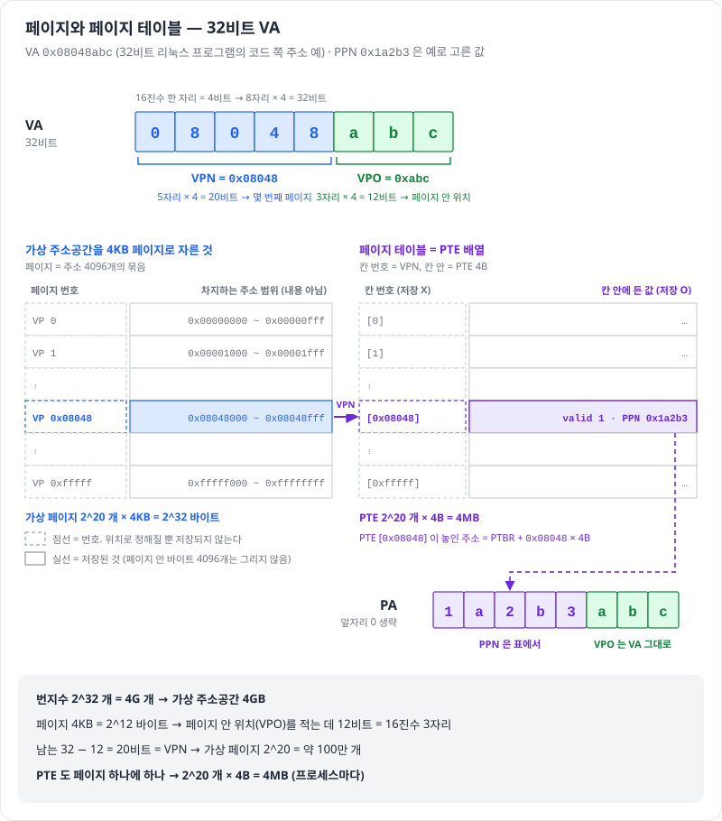
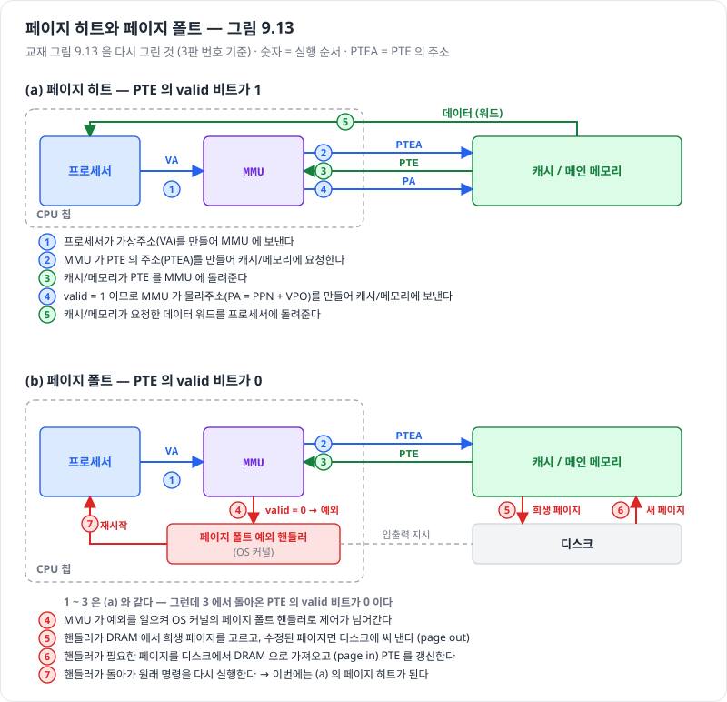
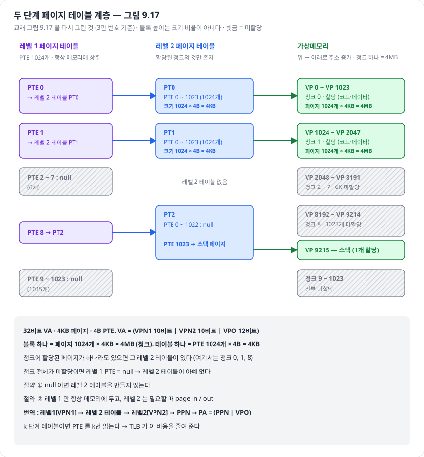

# 가상메모리와 페이징

> 진척도 이슈 : [#95](https://github.com/Jongeume/krafton-jungle-2026/issues/95)

> [!NOTE]
> **요약**  
> 가상메모리 = 프로세스마다 **0번지부터 시작하는 큰 바이트 배열**이 있는 것처럼 보이게 하는 체계.  
> 그 배열을 **페이지**(보통 4KB) 단위로 잘라, 쓰는 페이지만 DRAM 에 올린다 = 페이징.  
> CPU 가 낸 가상주소(VA)를 MMU 가 **페이지 테이블**을 보고 물리주소(PA)로 바꾼다.

> [!TIP]
> **비유**  
> 디스크 = 도서관 서고, DRAM = 내 책상, 페이지 = 책 한 권.  
> 지금 보는 책만 책상에 올려 두고, 없는 책을 펴면 서고에 다녀온다 = 페이지 폴트.  
> 페이지 테이블 = "가상 몇 번 책이 책상 몇 번 자리에 있나" 적어 둔 명부.

- 자세한 정리 : [CS:APP 9장 노트](../csapp/09-virtual-memory/README.md) 9.1 ~ 9.7 · [9.6 주소의 번역](../csapp/09-virtual-memory/04-address-translation.md) · [9.6.3 다중 레벨 페이지 테이블](../csapp/09-virtual-memory/05-multi-level-page-tables.md)

---

## 1. 왜 가상메모리인가 — 세 가지 역할

| 역할 | 무엇을 해 주나 | 교재 |
| --- | --- | --- |
| 캐시 | DRAM 을 디스크에 있는 가상 페이지의 캐시로 쓴다 → 작은 DRAM 으로 큰 주소공간 | 9.3 |
| 메모리 관리 | 프로세스마다 페이지 테이블이 따로 → 모두 같은 배치(0번지부터), 링크 · 로딩 · 공유 · 할당이 쉬워진다 | 9.4 |
| 보호 | PTE 의 허가 비트(읽기 · 쓰기 · 사용자/커널)를 번역할 때마다 검사 → 어기면 SIGSEGV | 9.5 |

## 2. 주소공간과 페이지

- 주소공간 = n 비트로 적을 수 있는 **번지수의 집합** {0 … 2^n − 1}  
    - 32비트 → 4GB, 48비트 → 256TB  
    - 가상은 프로세스마다 하나, 물리는 시스템에 하나

- 페이지 크기 P = 2^p 바이트 (4KB 면 p = 12)  
    - VA = ( **VPN** | **VPO** ) — 몇 번째 페이지인가 | 페이지 안 몇 번째 바이트인가  
    - 32비트 · 4KB : VPN 20비트 | VPO 12비트 → 16진수로 앞 5자리 | 뒤 3자리

- 가상 페이지 상태 셋 (PTE 로 구분)

| 상태 | PTE |
| --- | --- |
| cached — DRAM 에 있음 | valid 1, 물리 페이지 번호(PPN) |
| uncached — 디스크에만 | valid 0, 디스크 위치 |
| unallocated — 할당 안 됨 | valid 0, NULL |

## 3. 주소 번역 — VPN 만 바꾼다

1. VA 를 ( VPN | VPO ) 로 자른다  
2. PTE 주소 = 페이지 테이블 시작(PTBR) + VPN × PTE 크기 → PTE 를 읽는다  
3. valid 1 → PA = ( PPN | VPO ), valid 0 → 페이지 폴트

- 예 (4KB 페이지) : VA 0x2ABC → VPN 0x2, VPO 0xABC → PTE 의 PPN 이 0x7 이면 PA 0x7ABC  
    - VPO 는 그대로 붙인다 — 가상 페이지와 물리 페이지 크기가 같아서

## 4. 페이지 폴트와 요구 페이징

- 폴트가 나면  
    1. 커널이 희생 페이지를 고른다 (수정됐으면 디스크에 쓴다)  
    2. 필요한 페이지를 디스크에서 들여온다  
    3. PTE 를 고친다  
    4. **같은 명령을 다시 실행** → 이번엔 히트

- **요구 페이징** : 미리 올리지 않고 처음 건드릴 때 폴트로 들여온다  
- 작업 집합이 DRAM 보다 크면 폴트가 끝없이 난다 = **쓰레싱**

## 5. 번역을 빠르고 작게 — TLB 와 다중 레벨 표

| 장치 | 얻는 것 | 내주는 것 |
| --- | --- | --- |
| TLB (MMU 안의 PTE 캐시) | 히트면 페이지 테이블을 읽지 않는다 | 미스면 PTE 를 메모리에서 가져와야 한다 (그래도 페이지 폴트는 아니다) |
| 다중 레벨 페이지 테이블 | 안 쓰는 구간의 표를 만들지 않아 표가 작다 (한 덩어리면 32비트 4MB, 48비트 512GB) | 단계 수만큼 PTE 를 읽는다 → TLB 가 메운다 |

- Core i7 : 48비트 VA, 4단계, VPN 36비트를 9비트씩 → 표 하나 = 512 × 8B = 4KB = 페이지 하나, CR3 가 1단계 표를 가리킨다

## 6. 리눅스와 메모리 매핑 (힙이 어디서 오나)

- 리눅스는 가상메모리를 **영역**(코드 · 데이터 · .bss · 힙 · 공유 라이브러리 · 스택) 단위로 관리한다  
    - 영역 밖 주소 → segmentation fault, 권한 위반 → 보호 예외

- 영역은 디스크 객체에 **매핑**된다 : 보통 파일 또는 익명 파일(0)  
    - 힙 · 스택 · .bss = 익명 → 처음 건드리면 0 으로 채운 페이지 (**demand-zero**)  
    - fork = 페이지 테이블만 복사 + copy-on-write

## 7. malloc-lab 과 이어지는 곳

- `mem_sbrk` 로 늘리는 힙 = 가상주소 공간의 힙 영역 (실제 sbrk 는 커널의 brk 를 옮긴다)  
- 새로 받은 힙 페이지는 처음 쓸 때 demand-zero 페이지로 들어온다  
- 블록을 8바이트로 정렬하는 이유 : 메모리 · 캐시가 정렬된 접근을 전제로 하기 때문

## 스스로 확인

- [ ] 32비트 · 4KB 페이지에서 VA 0x08048ABC 의 VPN 과 VPO 는? (→ 0x08048 · 0xABC)  
- [ ] TLB 미스와 페이지 폴트는 각각 무엇을 가져오나?  
- [ ] 페이지 테이블을 한 덩어리로 두면 왜 문제인가? 다중 레벨은 무엇을 내주나?  
- [ ] fork 직후 자식이 변수에 쓰면 무슨 일이 일어나나?
