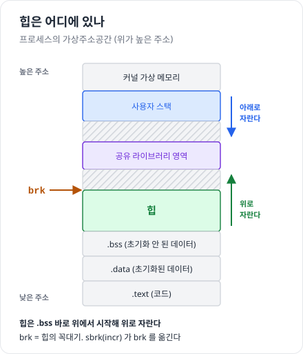

# 동적 메모리 할당 — 힙 · sbrk · malloc · free

> 진척도 이슈 : [#96](https://github.com/Jongeume/krafton-jungle-2026/issues/96)

> [!NOTE]
> **요약**  
> **힙** = .bss 바로 위에서 위로 자라는 영역. 커널은 그 꼭대기를 **brk** 로 기억한다.  
> **할당기**(malloc 패키지)는 힙을 블록으로 잘라 malloc 에 내주고, free 로 돌려받는다.  
> 힙이 모자라면 **sbrk**(brk 옮기기) 또는 **mmap**(새 영역)으로 커널에게 메모리를 더 받는다.

> [!TIP]
> **비유**  
> 힙 = 긴 창고 선반, 할당기 = 선반을 잘라 칸을 내주는 창구.  
> malloc = "적어도 이만큼"인 칸을 받는 것, free = 칸 반납 (창구는 영수증도 경고도 주지 않는다).  
> 선반 끝이 모자라면 건물주(커널)에게 선반을 더 달라고 한다 = sbrk.

- 자세한 정리 : [9.9 동적 메모리 할당](../csapp/09-virtual-memory/08-dynamic-memory-allocation.md) 9.9 ~ 9.9.3

---

## 1. 힙과 brk



- 위치 : 초기화 안 된 데이터(.bss) 바로 위, **위로** 자란다 (스택은 아래로)  
- 커널 변수 **brk** = 힙의 꼭대기 (program break)  
- 힙도 가상메모리 영역 → 처음 건드린 페이지는 0 으로 채워져 들어온다 (demand-zero, #95)

## 2. sbrk — 힙 늘리기

```c
void *sbrk(intptr_t incr);
```

- brk 에 incr 을 더한다  
    - 성공 : **옛 brk** 를 돌려준다 = 새로 생긴 영역의 시작  
    - 실패 : −1 (errno = ENOMEM)

- 예 : brk = 1000  
    1. sbrk(24) → 1000 을 돌려준다  
    2. brk = 1024  
    3. 할당기는 1000 ~ 1023 을 새 블록으로 쓴다

- malloc-lab 의 `mem_sbrk` = 이 sbrk 를 흉내 낸 함수 (줄이기는 안 된다)

| | sbrk | mmap |
| --- | --- | --- |
| 늘어나는 곳 | 힙 끝에 이어 붙는다 | 아무 데나 새 영역 |
| 돌려주기 | 끝에서만 줄인다 (가운데 빈 곳은 못 돌려준다) | 영역마다 munmap |
| 단위 | 바이트 | 페이지 (4KB) |

- 실제 glibc : 작은 요청은 sbrk 로 늘린 힙에서, 큰 요청(기본 128KB 이상)은 mmap 으로 따로 받고 free 하면 바로 munmap

## 3. malloc · free 의 약속

```c
void *malloc(size_t size);
void free(void *ptr);
```

| 함수 | 약속하는 것 | 약속하지 않는 것 |
| --- | --- | --- |
| malloc | **적어도** size 바이트, 정렬된 주소 (32비트 8B · 64비트 16B 배수), 실패하면 NULL | 내용 초기화 (있던 값 그대로) |
| calloc | 0 으로 채운 블록 | — |
| realloc | 크기를 바꾸고 옛 내용(작은 쪽까지)을 보존 | 같은 주소 (옮겨질 수 있다) |
| free | ptr 블록을 돌려받는다 | 오류 보고 — 돌려주는 값이 없다 |

- free 의 ptr 은 malloc 계열이 돌려준 **블록의 시작 주소**여야 한다  
    - 아니면 결과가 정해져 있지 않다 → 5주차 gdb 의 UAF · double free 가 여기서 나온다

## 4. 왜 동적 할당인가

- 자료구조의 크기를 **실행해 봐야** 아는 경우가 많다  
    - 고정 크기 배열 (`#define MAXN 15213`) : 넘치면 다시 컴파일, 남으면 낭비  
    - malloc : 가상메모리가 허락하는 만큼 그때그때 받는다

## 5. 할당기가 지켜야 할 것 (9.9.3)

1. 요청이 **어떤 순서로 와도** 처리한다  
2. 요청에 **바로 응답**한다 — 모아 두거나 순서를 바꿀 수 없다  
3. **힙만** 쓴다 — 할당기 자신의 자료구조도 힙 안에 (malloc-lab 이 전역 배열을 막는 이유)  
4. 블록을 **정렬**한다  
5. 할당한 블록은 **옮기거나 줄이지 않는다** — 그래서 단편화를 압축으로 없앨 수 없다 (#97)

## 6. 할당기가 노리는 것 — 처리량 ↔ 이용도

| | 처리량 | 이용도 |
| --- | --- | --- |
| 뜻 | 단위 시간당 처리한 요청 수 | 최대 페이로드 합 ÷ 힙 크기 |
| mdriver | Kops (초당 요청 수 ÷ 1000), 600 Kops 이상이면 만점 | trace 별 이용도의 평균 |
| 높이려면 | 덜 찾고 빨리 고른다 | 오래 찾아 잘 고른다 |

- 둘은 부딪친다 → #98 · #99 의 모든 선택이 이 둘 사이의 균형

## 7. malloc-lab 에서 한 것

- `mm_init` : `mem_sbrk` 로 패딩 · 프롤로그 · 에필로그를 받고, `extend_heap` 으로 첫 가용 블록 (4KB)  
- `mm_malloc` : 요청 크기 → 블록 크기(asize) → `find_fit` → `place`, 없으면 `extend_heap`  
- `mm_free` : 할당 비트 0 → `coalesce`  
- `mm_realloc` : 줄이기 · 오른쪽 빈 블록 흡수 · 새로 할당 + 복사 → [malloc-lab 실험 기록](../../weekly/week6/malloc-lab/README.md)

## 스스로 확인

- [ ] sbrk(24) 가 돌려주는 주소는 새 영역의 시작인가 끝인가?  
    - 답 : **시작**. 성공하면 옛 brk 를 돌려주는데, 그게 새로 생긴 영역의 첫 주소다

- [ ] malloc(1) 이 돌려준 블록은 몇 바이트인가? (-m32, 헤더 · 풋터 있는 구현 → 16B)  
    - 답 : **16B**. 헤더 4 + 풋터 4 = 8B 에 페이로드 1B 를 더해 8 의 배수로 올리면 16B (최소 블록도 16B)

- [ ] free 가 에러를 알려주지 않아서 생기는 버그 두 가지는?  
    - 답 : **UAF**(free 한 블록을 계속 씀)와 **double free**(같은 블록을 두 번 free). free 가 아무것도 돌려주지 않아 그 자리에서 알 수 없고, 나중에 엉뚱한 곳에서 데이터가 깨진다

- [ ] 할당기가 블록을 옮길 수 없으면 무엇을 포기하게 되나?  
    - 답 : **압축**(빈 공간을 모으려고 블록을 옮기기)을 포기한다. 프로그램이 블록 주소를 포인터로 들고 있어서 옮기면 포인터가 다 틀린다 → 외부 단편화는 옮겨서 없앨 수 없고, 배치 · 연결로 **미리 막아야** 한다
