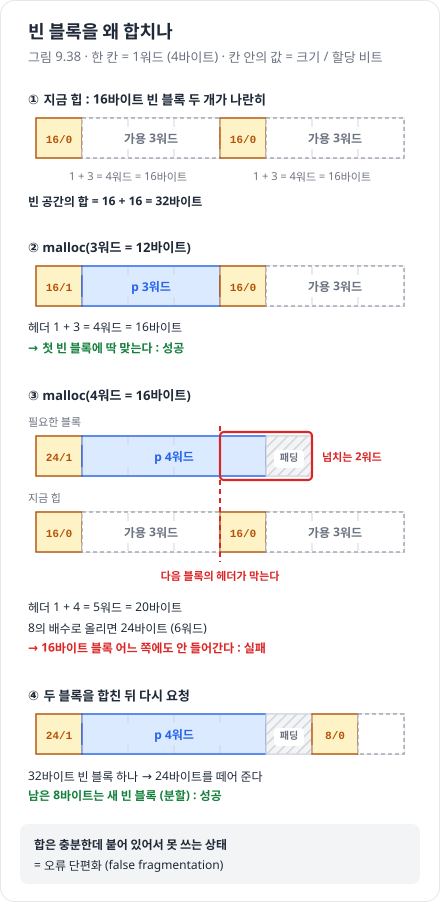

# 메모리 단편화

> 진척도 이슈 : [#97](https://github.com/Jongeume/krafton-jungle-2026/issues/97)

> [!NOTE]
> **요약**  
> 단편화 = 메모리가 있는데도 **쓰지 못하는** 상태. 이용도를 떨어뜨리는 원인이다.  
> **내부** 단편화 = 블록 안의 낭비 (정렬 · 헤더 · 최소 블록).  
> **외부** 단편화 = 빈 공간 합은 충분한데 흩어져서 한 블록으로는 모자란 것.

> [!TIP]
> **비유**  
> 내부 = 큰 상자에 작은 물건을 넣어 남는 공간.  
> 외부 = 영화관에 빈자리가 6개 남았는데 한 칸씩 떨어져 있어서, 나란히 앉을 4명 일행을 받지 못한다.  
> 이미 앉은 관객은 옮길 수 없다 (할당 블록은 옮기지 않는다).

- 자세한 정리 : [9.9 동적 메모리 할당](../csapp/09-virtual-memory/08-dynamic-memory-allocation.md) 9.9.4 · 9.9.10

---

## 1. 내부 단편화

- 블록이 페이로드보다 클 때 생긴다

- 원인  
    - **정렬** : 8 의 배수로 올린다  
    - **헤더 · 풋터** : 블록마다 오버헤드  
    - **최소 블록 크기** : 아주 작은 요청도 최소 크기 블록을 받는다  
    - 분할하지 않고 큰 블록을 통째로 줄 때

- 작은 숫자 예 (-m32, 헤더 4B + 풋터 4B, 8B 정렬)

| 요청 | 블록 | 낭비 |
| --- | --- | --- |
| malloc(1) | 16B (최소 블록) | 15B |
| malloc(13) | 24B (13 + 8 → 8 의 배수로 올림) | 11B |
| malloc(16) | 24B | 8B |

- 지금까지의 요청만 보면 **셀 수 있다**

## 2. 외부 단편화

- 빈 메모리의 **합**은 충분한데 한 덩어리가 모자랄 때 생긴다  
- 원인 : 빈 블록이 띄엄띄엄 흩어져 있다  
- 앞으로 올 요청에 달려 있어서 **세기 어렵다**  
    - 지금 흩어진 빈칸도 작은 요청만 오면 문제가 아니다

- 그래서 할당기는 **작은 빈 블록 여러 개보다 큰 빈 블록 몇 개**를 남기려 한다

## 3. 거짓 단편화 (false fragmentation)

- 빈 블록이 **붙어 있는데** 아직 안 합쳐서 큰 요청을 못 받는 것 (그림 9.38)  
- 해결 : **연결**(coalescing) — free 할 때 옆 빈 블록과 합친다  
    - 경계 태그(풋터)로 앞 블록도 상수 시간에 찾는다

## 4. 줄이는 방법과 그 대가

| 방법 | 줄이는 것 | 내주는 것 |
| --- | --- | --- |
| 분할 (place) | 내부 — 큰 블록의 남는 부분을 새 빈 블록으로 | 작은 조각이 늘어 외부 단편화 · 탐색이 늘 수 있다 |
| 즉시 연결 (coalesce) | 거짓 · 외부 — 큰 빈 블록 유지 | free 마다 일한다 |
| 배치 정책 (best fit, 주소 순 first fit) | 외부 — 잘 맞는 블록을 골라 큰 블록을 지킨다 | 더 많이 훑는다 → 처리량 ↓ (#98) |
| 풋터 줄이기 (할당 블록은 헤더만) | 내부 — 블록마다 1워드 | 상태가 바뀔 때 뒤 블록 헤더 비트도 고친다 |
| 분리 가용 리스트 | 외부 — 비슷한 크기끼리 → best fit 에 가깝다 | 구현이 복잡하다 (#99) |

## 5. malloc-lab 에서 본 외부 단편화

- 명시적 리스트를 **LIFO** 로 넣었더니 realloc trace 이용도 80% → **33%**  
    - LIFO 는 크기와 상관없이 방금 free 된 블록부터 쪼갠다 → 빈 공간이 흩어진다  
    - realloc 이 큰 블록을 다시 달라고 하면 맞는 덩어리가 없어 힙을 또 늘린다

- **주소 순**으로만 바꾸자 33% → **80%** (원인 확인) → [malloc-lab 실험 기록](../../weekly/week6/malloc-lab/README.md)  
    - 왼쪽 빈틈부터 메워 오른쪽 큰 빈 블록을 지킨다

- realloc 은 "새로 할당 + 복사 + 옛 블록 free" 를 할 때 옛 자리가 빈칸으로 남아 외부 단편화를 만든다 → 제자리 확장으로 줄였다 ([malloc-lab 실험 기록](../../weekly/week6/malloc-lab/README.md))

- 반대로 크기별 캐시(tcache 방식)는 블록을 합치지 않고 붙잡아서 단편화를 **늘릴 수** 있다  
    - 상한을 4096B 까지 넓히자 이용도가 136B 일 때보다 떨어졌다 → [malloc-lab 실험 기록](../../weekly/week6/malloc-lab/README.md)

## 스스로 확인

- [ ] -m32 에서 malloc(5) 의 내부 단편화는 몇 바이트인가? (→ 16B 블록, 11B)  
    - 답 : 블록 = 5 + 8 = 13 → 8 의 배수로 올려 **16B**. 페이로드 5B 를 빼면 **11B** (패딩 3B + 헤더 · 풋터 8B)

- [ ] 외부 단편화를 "세기 어려운" 이유는?  
    - 답 : 흩어진 빈 블록이 문제가 될지는 **앞으로 올 요청의 크기**에 달려 있다. 작은 요청만 오면 문제가 아니고, 큰 요청이 오면 문제다 → 지금 상태만 보고는 셀 수 없다

- [ ] 거짓 단편화와 외부 단편화는 어떻게 다른가?  
    - 답 : 거짓 단편화 = 빈 블록이 **붙어 있는데** 아직 안 합친 것 → 연결(coalesce)로 해결된다. 외부 단편화 = 빈 블록 사이에 **할당 블록이 끼어** 떨어져 있는 것 → 연결로도 못 합친다

- [ ] 할당기가 블록을 옮길 수 있다면(압축) 외부 단편화는 어떻게 되나? C 의 malloc 은 왜 못 하나?  
    - 답 : 옮길 수 있으면 빈 공간을 한쪽으로 모아 외부 단편화를 **없앨 수** 있다 (Java · C# 의 GC 가 압축할 때 하는 일). C 는 프로그램이 블록 주소를 날 포인터로 들고 있어서 옮기면 그 포인터가 다 틀린다 → 할당기 요구사항 5번 "할당한 블록은 건드리지 않는다"
