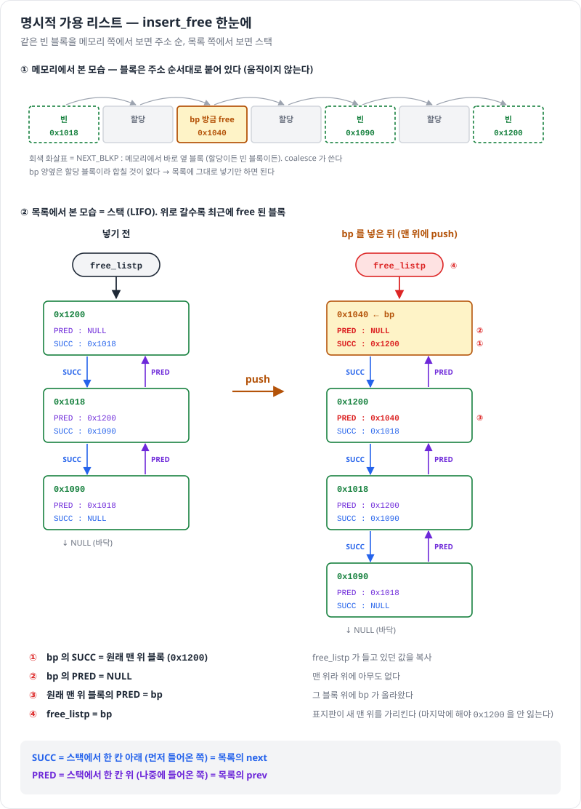

# 묵시적 · 명시적 가용 리스트

> 진척도 이슈 : [#99](https://github.com/Jongeume/krafton-jungle-2026/issues/99)

> [!NOTE]
> **요약**  
> 가용 리스트 = 빈 블록을 찾는 방법.  
> **묵시적** : 블록 헤더의 크기만큼 건너뛰며 **모든 블록**을 훑는다 → O(전체 블록 수).  
> **명시적** : 빈 블록의 페이로드 자리에 PRED · SUCC 포인터를 넣어 **빈 블록끼리만** 잇는다 → O(빈 블록 수).

> [!TIP]
> **비유**  
> 묵시적 = 칸마다 붙은 꼬리표(헤더)를 보며 사용 중인 칸까지 전부 지나간다.  
> 명시적 = 빈 칸끼리만 줄을 이어 둔다 → 사용 중인 칸은 건너뛴다.  
> 줄을 잇는다고 칸이 한곳에 모이는 건 아니다 — 칸은 제자리, 줄만 이어진다.

- 자세한 정리 : [9.9 동적 메모리 할당](../csapp/09-virtual-memory/08-dynamic-memory-allocation.md) 9.9.6 · 9.9.13 · [9.9.13 명시적 가용 리스트](../csapp/09-virtual-memory/08-dynamic-memory-allocation.md)

---

## 1. 묵시적 가용 리스트

- 블록 = 헤더 (크기 | 할당 비트) + 페이로드 + 패딩 + 풋터  
    - 크기는 8 의 배수 → 하위 3비트가 남아 할당 비트로 쓴다  
    - 다음 블록 = 내 주소 + 내 크기 → 별도 포인터 없이 힙 전체가 리스트

- 풋터 = 헤더 사본 (**경계 태그**)  
    - 앞 블록의 크기를 바로 읽는다 → 연결(coalesce) 4가지 경우를 상수 시간에

- 프롤로그 · 에필로그 : 양 끝의 "할당" 블록 → 끝 검사 없이 연결

| 얻는 것 | 내주는 것 |
| --- | --- |
| 구현이 단순하다, 최소 블록이 작다 (-m32 16B) | 탐색이 **할당 블록까지** 훑어 전체 블록 수에 비례 |

## 2. 명시적 가용 리스트

- 빈 블록의 페이로드 자리에 포인터 둘  
    - PRED : 리스트에서 위(앞) 빈 블록  
    - SUCC : 리스트에서 아래(다음) 빈 블록  
    - 블록이 비었으니 페이로드 자리를 써도 된다

- `-m32` : 헤더 4 + PRED 4 + SUCC 4 + 풋터 4 = **16B** → 최소 블록이 그대로  
    - 64비트면 포인터가 8B → 최소 블록 24B 이상

| | 메모리 이웃 | 리스트 이웃 |
| --- | --- | --- |
| 이름 | PREV_BLKP · NEXT_BLKP | PRED · SUCC |
| 무엇 | 바로 옆 블록 (할당이든 빈 블록이든) | 리스트의 앞 · 다음 빈 블록 (힙 어디에 있든) |
| 구하는 법 | 헤더 · 풋터 크기로 계산 | 블록 안에 적어 둔 주소를 읽음 |
| 쓰는 곳 | coalesce | insert · remove · find_fit |

## 3. 빈 블록을 넣는 순서

| 순서 | 넣기 | 얻는 것 | 내주는 것 |
| --- | --- | --- | --- |
| **LIFO** (맨 위에) | 상수 시간 | free 가 빠르다 | 크기를 안 가려 큰 블록을 쪼갠다 → 이용도 ↓ |
| **주소 순** | 넣을 자리를 훑는다 | 왼쪽부터 채워 best fit 에 가까운 이용도 | free 마다 훑어 처리량 ↓ |

## 4. 기존 함수에 붙이는 규칙 — "빈 블록이 생기면 넣고, 사라지거나 합쳐지면 뺀다"

| 함수 | 할 일 |
| --- | --- |
| mm_init | `free_listp` = NULL |
| coalesce | 합치기 **전에** 빈 이웃을 빼고, 합친 블록을 한 번 넣는다 |
| place | 맨 처음 bp 를 빼고, 쪼갰으면 남은 조각을 넣는다 |
| find_fit | `free_listp` 부터 SUCC 를 따라 NULL 까지 |
| mm_realloc | 흡수할 오른쪽 빈 블록을 먼저 뺀다. bp 는 리스트에 없으니 place 를 쓰지 않는다 |

## 5. 두 리스트 비교 — 내 malloc-lab 결과

| | 묵시적 + first fit | 명시적 LIFO | 명시적 주소 순 |
| --- | --- | --- | --- |
| 탐색 대상 | 모든 블록 | 빈 블록 | 빈 블록 |
| 전체 이용도 | 80% | 71% | 80% |
| 전체 처리량 (Kops) | 198 | 2,114 | 298 |
| Perf index | 61 | 83 | 68 |

- 묵시적 → 명시적 LIFO : 처리량 약 11배 (할당 블록을 건너뛴다), 이용도 −9%p (LIFO 탓)  
- LIFO → 주소 순 : 이용도는 돌아왔지만 free 마다 훑어 binary2 처리량이 7,536 → 83  
- 다음 단계 : **분리 가용 리스트** — 크기별로 리스트를 나눠 짧은 리스트(처리량) + 비슷한 크기(이용도)를 함께 얻는다 (9.9.14)

## 스스로 확인

- [ ] 묵시적 리스트에서 다음 블록 주소는 어떻게 구하나? 앞 블록은?  
    - 답 : 다음 블록 = bp + **내 헤더의 크기** (`NEXT_BLKP`). 앞 블록 = bp − **앞 블록 풋터의 크기** (`PREV_BLKP`, 풋터는 내 헤더 바로 앞 = bp − 8). 내 크기가 아니라 앞 블록 크기를 빼는 게 핵심

- [ ] 명시적 리스트에서 빈 블록이 "한곳에 모이지 않는" 이유는?  
    - 답 : 리스트는 빈 블록의 **주소를 이어 둔 목록**일 뿐, 블록은 메모리의 제자리에 그대로 있다. 합치기는 coalesce 가 **메모리에서 바로 옆**인 블록끼리만 한다

- [ ] coalesce 에서 빈 이웃을 **합치기 전에** 빼야 하는 이유는?  
    - 답 : 합치면 이웃 블록은 더 이상 따로 존재하지 않는다 (헤더 · 풋터가 덮인다). 그런데 리스트에는 그 블록의 PRED · SUCC 연결이 남아 있어서, 먼저 빼지 않으면 리스트가 **합친 블록 한가운데**를 가리키게 된다 → 이웃을 먼저 빼고, 합친 블록을 한 번 넣는다

- [ ] realloc 에서 place 를 그대로 부르면 왜 리스트가 깨지나?  
    - 답 : place 는 맨 처음 `remove_free(bp)` 를 한다. realloc 의 bp 는 **할당 블록이라 리스트에 없고**, PRED · SUCC 자리에 사용자 데이터가 들어 있다 → 그 값을 포인터로 따라가 엉뚱한 곳을 고쳐 리스트가 깨지거나 Segfault 가 난다
